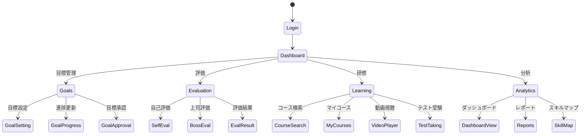

# ユーザーストーリー・ユースケース定義書

## 1. 概要

本ドキュメントは、人事評価・研修統合プラットフォームの主要なユーザーストーリーとユースケースを定義します。

---

## 2. ペルソナ定義

### 2.1 田中 太郎（一般従業員）
- **年齢**: 28歳
- **役職**: 営業部 主任
- **経験**: 入社5年目
- **ITスキル**: 中程度
- **目標**: スキルアップして次の昇進を目指したい
- **課題**: 業務が忙しく、どの研修を受ければよいか分からない

### 2.2 山田 花子（管理職）
- **年齢**: 42歳
- **役職**: 営業部 課長
- **経験**: 管理職歴5年
- **ITスキル**: 中程度
- **目標**: 部下の成長を支援し、チーム全体の成果を上げたい
- **課題**: 部下一人ひとりに適切なフィードバックを与える時間が限られている

### 2.3 佐藤 一郎（人事担当者）
- **年齢**: 35歳
- **役職**: 人事部 主任
- **経験**: 人事業務7年
- **ITスキル**: 高い
- **目標**: 評価制度を公平かつ効率的に運用したい
- **課題**: 評価データの集計に時間がかかり、分析に注力できない

### 2.4 鈴木 次郎（テナント管理者）
- **年齢**: 45歳
- **役職**: 情報システム部 部長
- **経験**: IT管理15年
- **ITスキル**: 非常に高い
- **目標**: 安全で効率的なシステム運用を実現したい
- **課題**: 複数システムの管理が煩雑

---

## 3. ユーザーストーリー

### 3.1 認証・アカウント管理

#### US-AUTH-001: 初回ログイン
```
一般従業員として、
招待メールからアカウントを有効化し、パスワードを設定したい。
なぜなら、安全にシステムを利用開始するためである。

受入基準:
- 招待メールのリンクをクリックするとパスワード設定画面が表示される
- パスワードポリシーが明示される
- 設定完了後、ダッシュボードにリダイレクトされる
```

#### US-AUTH-002: 多要素認証の設定
```
一般従業員として、
多要素認証を設定したい。
なぜなら、アカウントのセキュリティを強化するためである。

受入基準:
- 設定画面から MFA を有効化できる
- QRコードでAuthenticatorアプリに登録できる
- バックアップコードが発行される
```

#### US-AUTH-003: パスワードリセット
```
一般従業員として、
パスワードを忘れた場合にリセットしたい。
なぜなら、アカウントへのアクセスを回復するためである。

受入基準:
- メールアドレスを入力するとリセットリンクが送信される
- リンクは24時間有効
- 新しいパスワードを設定できる
```

---

### 3.2 目標設定・管理

#### US-GOAL-001: 期初目標の設定
```
一般従業員として、
期初に自分の目標を設定したい。
なぜなら、今期の業務の方向性を明確にするためである。

受入基準:
- 目標を複数登録できる
- 各目標に重要度（ウェイト）を設定できる
- 達成基準を具体的に記述できる
- 部門目標との紐付けができる
- 一時保存ができる
```

#### US-GOAL-002: 目標の承認申請
```
一般従業員として、
設定した目標を上司に承認申請したい。
なぜなら、上司と目標について合意を得るためである。

受入基準:
- 承認申請ボタンをクリックすると上司に通知が送られる
- 申請状態が「承認待ち」に変わる
- 上司からのフィードバックを受け取れる
```

#### US-GOAL-003: 部下の目標承認
```
管理職として、
部下が設定した目標を確認し、承認またはフィードバックを行いたい。
なぜなら、部下の目標が適切かどうかを確認するためである。

受入基準:
- 承認待ちの目標一覧が表示される
- 各目標に対してコメントを付けられる
- 承認、差し戻し、修正依頼ができる
- 承認後、部下に通知される
```

#### US-GOAL-004: 目標の進捗更新
```
一般従業員として、
目標の進捗状況を定期的に更新したい。
なぜなら、達成度合いを可視化し、必要に応じて軌道修正するためである。

受入基準:
- 進捗率を数値で入力できる
- 進捗コメントを記録できる
- 更新履歴が保存される
- 上司が進捗を確認できる
```

---

### 3.3 評価実施

#### US-EVAL-001: 自己評価の入力
```
一般従業員として、
期末に自己評価を入力したい。
なぜなら、自分の成果を振り返り、上司に伝えるためである。

受入基準:
- 各目標に対して達成度を評価できる
- 自己評価コメントを記載できる
- 成果のエビデンスを添付できる
- 一時保存ができる
- 提出前にプレビューできる
```

#### US-EVAL-002: 上司評価の入力
```
管理職として、
部下の評価を入力したい。
なぜなら、部下の成果を公正に評価し、フィードバックするためである。

受入基準:
- 部下の自己評価を参照できる
- 各目標に対して評価を入力できる
- 評価コメントを記載できる
- 研修受講履歴を参照できる
- 複数の部下の評価を効率的に行える
```

#### US-EVAL-003: 360度評価の依頼
```
人事担当者として、
360度評価の対象者と評価者を設定したい。
なぜなら、多角的な視点からの評価を収集するためである。

受入基準:
- 対象者を選択できる
- 評価者（同僚、部下）を指定できる
- 評価依頼メールが自動送信される
- 評価期限を設定できる
- 匿名性を設定できる
```

#### US-EVAL-004: 評価結果の確認
```
一般従業員として、
自分の評価結果を確認したい。
なぜなら、今後の成長に活かすためである。

受入基準:
- 最終評価結果が表示される
- 上司からのコメントを確認できる
- 過去の評価履歴と比較できる
- 推奨される研修が表示される
```

---

### 3.4 研修受講

#### US-LMS-001: 研修コースの検索
```
一般従業員として、
自分に必要な研修コースを検索したい。
なぜなら、スキルアップに役立つ研修を見つけるためである。

受入基準:
- キーワードで検索できる
- カテゴリでフィルタリングできる
- 難易度で絞り込める
- 所要時間で絞り込める
- 評価結果に基づく推奨コースが表示される
```

#### US-LMS-002: 研修動画の視聴
```
一般従業員として、
研修動画を視聴したい。
なぜなら、業務に必要なスキルを習得するためである。

受入基準:
- 動画がスムーズに再生される
- 視聴を中断しても続きから再開できる
- 再生速度を変更できる（0.5x〜2.0x）
- 字幕が表示される（対応コンテンツ）
- 視聴完了が記録される
```

#### US-LMS-003: 理解度テストの受験
```
一般従業員として、
研修後に理解度テストを受験したい。
なぜなら、学習内容の定着を確認するためである。

受入基準:
- コース完了後にテストが表示される
- 制限時間が表示される
- 回答を提出すると即座に採点される
- 合格基準を満たすと修了証が発行される
- 不合格の場合、再受験できる
```

#### US-LMS-004: 学習進捗の確認
```
一般従業員として、
自分の学習進捗を確認したい。
なぜなら、学習計画を管理するためである。

受入基準:
- 受講中のコース一覧が表示される
- 各コースの進捗率が表示される
- 完了したコース一覧が表示される
- 総学習時間が表示される
- 取得した修了証が確認できる
```

#### US-LMS-005: 部下の受講状況確認
```
管理職として、
部下の研修受講状況を確認したい。
なぜなら、部下の成長を支援するためである。

受入基準:
- 部下一覧と各人の受講状況が表示される
- 未完了の必須研修が一目で分かる
- 受講勧奨のメッセージを送れる
- 詳細な学習履歴を確認できる
```

---

### 3.5 研修管理（管理者向け）

#### US-ADM-001: 研修コンテンツのアップロード
```
人事担当者として、
新しい研修動画をアップロードしたい。
なぜなら、最新の研修コンテンツを従業員に提供するためである。

受入基準:
- 動画ファイルをドラッグ&ドロップでアップロードできる
- アップロード進捗が表示される
- メタデータ（タイトル、説明、カテゴリ）を設定できる
- サムネイルを設定できる
- プレビューで確認できる
```

#### US-ADM-002: 研修コースの作成
```
人事担当者として、
複数のコンテンツを組み合わせて研修コースを作成したい。
なぜなら、体系的な学習パスを提供するためである。

受入基準:
- コースにコンテンツを追加できる
- コンテンツの順序を設定できる
- 前提条件を設定できる
- テストを追加できる
- 公開日時を設定できる
```

#### US-ADM-003: 研修の一括割り当て
```
人事担当者として、
特定の部署や職種に研修を一括で割り当てたい。
なぜなら、効率的に研修を展開するためである。

受入基準:
- 対象者を条件で絞り込める（部署、職種、役職など）
- 複数のコースを一度に割り当てられる
- 受講期限を設定できる
- 割り当て通知が自動送信される
```

---

### 3.6 分析・レポート

#### US-RPT-001: 評価分布の確認
```
人事担当者として、
評価結果の分布を確認したい。
なぜなら、評価の偏りがないか確認するためである。

受入基準:
- 評価分布がグラフで表示される
- 部門別、職種別で比較できる
- 前期との比較ができる
- データをエクスポートできる
```

#### US-RPT-002: 研修効果の分析
```
人事担当者として、
研修の効果を分析したい。
なぜなら、研修の改善に活かすためである。

受入基準:
- コース別の完了率が表示される
- テストの平均点が表示される
- 受講者のフィードバックが集計される
- 研修前後のスキル変化が可視化される
```

#### US-RPT-003: スキルギャップの分析
```
人事担当者として、
組織全体のスキルギャップを分析したい。
なぜなら、育成計画を立てるためである。

受入基準:
- 必要スキルと現状スキルの差が可視化される
- 部門別、職種別で分析できる
- 優先的に強化すべきスキルが特定できる
- 対応する研修が推奨される
```

---

### 3.7 連携機能

#### US-INT-001: 推奨研修の確認
```
一般従業員として、
評価結果に基づく推奨研修を確認したい。
なぜなら、自分に必要なスキルを効率的に習得するためである。

受入基準:
- ダッシュボードに推奨研修が表示される
- 推奨理由が明示される
- 優先度順に並んでいる
- ワンクリックで受講を開始できる
```

#### US-INT-002: スキルマップの確認
```
一般従業員として、
自分のスキルマップを確認したい。
なぜなら、強みと弱みを把握し、成長計画を立てるためである。

受入基準:
- 自分のスキルがレーダーチャートで表示される
- 目標とするスキルレベルとの差が分かる
- スキルを伸ばすための研修が表示される
- 時系列でのスキル変化が確認できる
```

---

## 4. 主要ユースケース図

### 4.1 全体ユースケース図

```mermaid
graph TB
    subgraph Actors
        Employee[一般従業員]
        Manager[管理職]
        HR[人事担当者]
        Admin[テナント管理者]
    end

    subgraph "認証"
        UC_Login[ログイン]
        UC_MFA[MFA設定]
        UC_PwReset[パスワードリセット]
    end

    subgraph "目標管理"
        UC_SetGoal[目標設定]
        UC_ApproveGoal[目標承認]
        UC_UpdateProgress[進捗更新]
    end

    subgraph "評価"
        UC_SelfEval[自己評価]
        UC_BossEval[上司評価]
        UC_360Eval[360度評価]
        UC_ViewResult[評価結果確認]
    end

    subgraph "研修"
        UC_SearchCourse[コース検索]
        UC_TakeCourse[コース受講]
        UC_TakeTest[テスト受験]
        UC_ManageCourse[コース管理]
    end

    subgraph "分析"
        UC_Dashboard[ダッシュボード]
        UC_Report[レポート生成]
        UC_SkillMap[スキルマップ]
    end

    Employee --> UC_Login
    Employee --> UC_SetGoal
    Employee --> UC_SelfEval
    Employee --> UC_SearchCourse
    Employee --> UC_TakeCourse
    Employee --> UC_SkillMap

    Manager --> UC_ApproveGoal
    Manager --> UC_BossEval
    Manager --> UC_Dashboard

    HR --> UC_360Eval
    HR --> UC_ManageCourse
    HR --> UC_Report

    Admin --> UC_MFA
```



---

## 5. ユースケース詳細

### 5.1 UC-001: 目標設定

| 項目 | 内容 |
|------|------|
| ユースケース名 | 目標設定 |
| アクター | 一般従業員 |
| 事前条件 | ログイン済み、評価期間が開始されている |
| 事後条件 | 目標が保存され、承認待ち状態になる |

**基本フロー:**
1. 従業員がダッシュボードから「目標設定」を選択
2. システムが目標設定画面を表示
3. 従業員が目標タイトルを入力
4. 従業員が目標の詳細内容を入力
5. 従業員が達成基準を入力
6. 従業員がウェイト（重要度）を設定
7. 従業員が部門目標との紐付けを選択
8. 手順3-7を必要な目標数だけ繰り返す
9. 従業員が「承認申請」ボタンをクリック
10. システムが入力内容を検証
11. システムが目標を保存し、上司に通知を送信
12. システムが完了メッセージを表示

**代替フロー:**
- A1: 一時保存（手順9の代わり）
  1. 従業員が「一時保存」をクリック
  2. システムが目標を下書き状態で保存
  3. 従業員は後で編集を再開できる

**例外フロー:**
- E1: 入力検証エラー
  1. システムがエラーメッセージを表示
  2. 従業員がエラー箇所を修正
  3. 基本フロー10に戻る

---

### 5.2 UC-002: 研修動画視聴

| 項目 | 内容 |
|------|------|
| ユースケース名 | 研修動画視聴 |
| アクター | 一般従業員 |
| 事前条件 | ログイン済み、コースに登録済み |
| 事後条件 | 視聴履歴が記録される |

**基本フロー:**
1. 従業員がマイコースから受講中コースを選択
2. システムがコース詳細画面を表示
3. 従業員が視聴するレッスンを選択
4. システムが動画プレーヤーを表示
5. システムが前回の視聴位置から再生を開始
6. 従業員が動画を視聴
7. システムが視聴進捗を定期的に記録（30秒ごと）
8. 動画が終了する
9. システムがレッスンを完了済みとしてマーク
10. システムが次のレッスンを提案

**代替フロー:**
- A1: 視聴の一時停止
  1. 従業員が一時停止ボタンをクリック
  2. システムが現在位置を記録
  3. 従業員が再開ボタンをクリック
  4. 基本フロー6に戻る

- A2: 再生速度の変更
  1. 従業員が速度設定を変更（0.5x〜2.0x）
  2. システムが指定速度で再生を継続

**例外フロー:**
- E1: ネットワークエラー
  1. システムがエラーメッセージを表示
  2. システムが自動的に再接続を試行
  3. 再接続成功後、中断箇所から再生を再開

---

### 5.3 UC-003: 上司評価入力

| 項目 | 内容 |
|------|------|
| ユースケース名 | 上司評価入力 |
| アクター | 管理職 |
| 事前条件 | ログイン済み、部下が自己評価を提出済み、評価期間内 |
| 事後条件 | 評価が保存され、次のワークフローに進む |

**基本フロー:**
1. 管理職が「評価タスク」メニューを選択
2. システムが評価待ちの部下一覧を表示
3. 管理職が評価対象の部下を選択
4. システムが評価入力画面を表示（部下の自己評価、研修履歴を含む）
5. 管理職が各目標に対して評価スコアを入力
6. 管理職が評価コメントを入力
7. 管理職が総合評価を入力
8. 管理職が「提出」ボタンをクリック
9. システムが入力内容を検証
10. システムが評価を保存
11. システムが次の承認者に通知を送信
12. 管理職が次の部下の評価に移る（手順3に戻る）

**代替フロー:**
- A1: 研修履歴の参照
  1. 管理職が「研修履歴」タブをクリック
  2. システムが部下の受講履歴、テスト結果を表示
  3. 管理職が評価の参考にする

- A2: 一時保存
  1. 管理職が「一時保存」をクリック
  2. システムが現在の入力内容を保存
  3. 管理職は後で編集を再開できる

---

## 6. シナリオ例

### シナリオ1: 新入社員の初年度評価サイクル

**登場人物:**
- 田中太郎（新入社員）
- 山田花子（直属上司）
- 佐藤一郎（人事担当者）

**ストーリー:**

1. **4月: オンボーディング**
   - 田中は招待メールからアカウントを作成
   - 必須研修コース（コンプライアンス、セキュリティ等）が自動割り当て
   - 1週間以内に必須研修を完了

2. **5月: 期初目標設定**
   - 田中が3つの目標を設定（営業スキル習得、製品知識獲得、顧客対応10件）
   - 山田が目標を確認し、コメント付きで承認
   - 関連する推奨研修が自動表示される

3. **6月-9月: 研修受講と進捗更新**
   - 田中が推奨された営業研修コースを受講
   - 毎月、目標の進捗を更新
   - 山田が進捗を確認し、1on1でフィードバック

4. **10月: 中間レビュー**
   - 田中が自己評価を入力
   - 山田が評価とフィードバックを入力
   - 追加の研修が推奨される

5. **3月: 期末評価**
   - 田中が最終自己評価を提出
   - 山田が研修履歴を参照しながら評価を実施
   - 佐藤が評価結果を確認・承認
   - 田中が評価結果と次期の推奨研修を確認

---

### シナリオ2: スキルギャップ解消による昇進

**登場人物:**
- 高橋健太（中堅社員、昇進候補）
- 伊藤美咲（直属上司）

**ストーリー:**

1. **評価結果確認**
   - 高橋が期末評価結果を確認
   - 「リーダーシップ」スキルが次の等級要件に満たないことが判明

2. **スキルマップ分析**
   - システムがスキルギャップを可視化
   - リーダーシップ研修3コースが推奨される

3. **学習計画策定**
   - 高橋が推奨研修を受講計画に追加
   - 伊藤が計画を承認

4. **研修受講**
   - 高橋が3ヶ月かけて研修を完了
   - すべてのテストに合格

5. **スキル再評価**
   - 次の評価サイクルでリーダーシップスキルが向上
   - 昇進要件を満たす

6. **昇進**
   - 人事部が研修履歴とスキル向上を確認
   - 昇進が承認される

---

## 7. 画面遷移概要



---

## 8. 変更履歴

| バージョン | 日付 | 変更内容 | 変更者 |
|------------|------|----------|--------|
| 1.0 | 2025-11-17 | 初版作成 | Claude |
