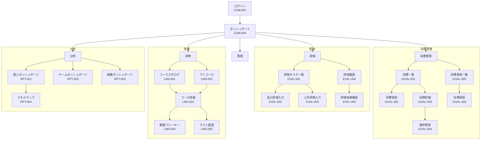
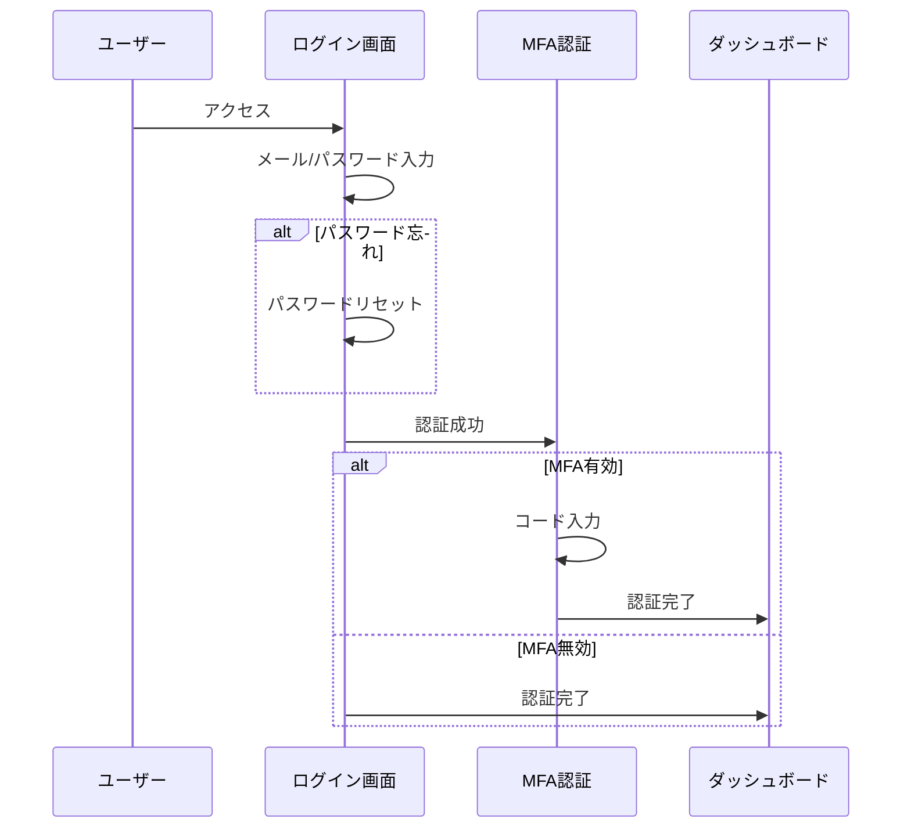
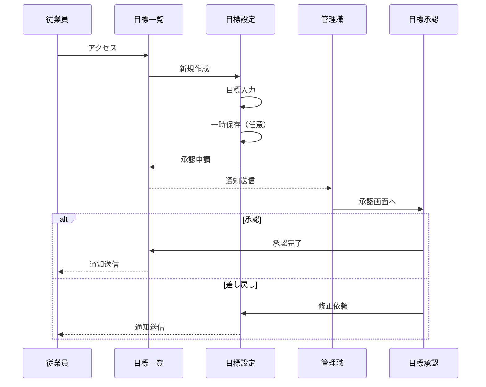
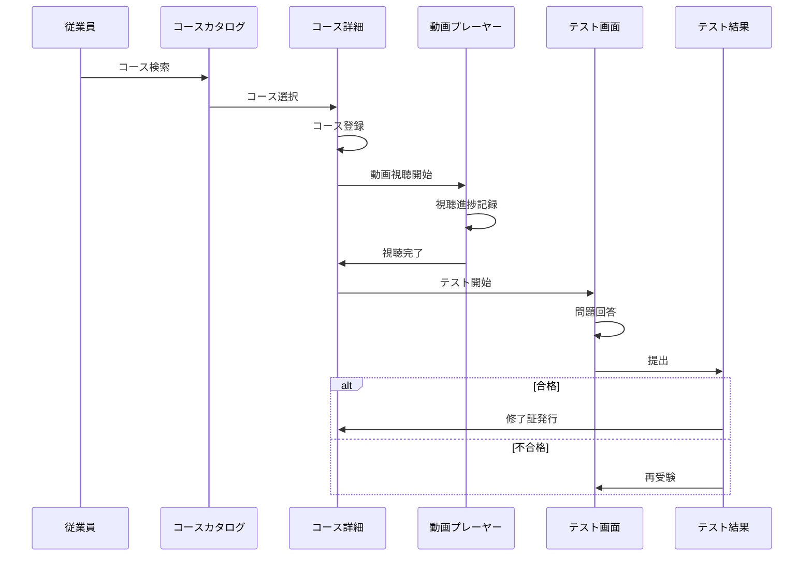

# 画面設計書

## 1. 概要

本ドキュメントは、人事評価・研修統合プラットフォームの画面構成、画面遷移、およびワイヤーフレームの概要を定義します。

---

## 2. 画面一覧

### 2.1 共通画面

| 画面ID | 画面名 | 概要 | アクセス権限 |
|--------|--------|------|--------------|
| COM-001 | ログイン | システムへのログイン | 全ユーザー |
| COM-002 | パスワードリセット | パスワードの再設定 | 全ユーザー |
| COM-003 | MFA設定 | 多要素認証の設定 | 全ユーザー |
| COM-004 | ダッシュボード | メイン画面 | 全ユーザー |
| COM-005 | プロフィール設定 | 個人情報の編集 | 全ユーザー |
| COM-006 | 通知一覧 | システム通知の確認 | 全ユーザー |

### 2.2 目標管理画面

| 画面ID | 画面名 | 概要 | アクセス権限 |
|--------|--------|------|--------------|
| GOAL-001 | 目標一覧 | 自分の目標一覧 | 従業員以上 |
| GOAL-002 | 目標設定 | 新規目標の作成 | 従業員以上 |
| GOAL-003 | 目標詳細 | 目標の詳細情報 | 従業員以上 |
| GOAL-004 | 進捗更新 | 目標進捗の更新 | 従業員以上 |
| GOAL-005 | 目標承認一覧 | 承認待ち目標の一覧 | 管理職以上 |
| GOAL-006 | 目標承認 | 部下目標の承認 | 管理職以上 |

### 2.3 評価画面

| 画面ID | 画面名 | 概要 | アクセス権限 |
|--------|--------|------|--------------|
| EVAL-001 | 評価タスク一覧 | 評価関連タスク | 従業員以上 |
| EVAL-002 | 自己評価入力 | 自己評価の入力 | 従業員以上 |
| EVAL-003 | 上司評価入力 | 部下の評価入力 | 管理職以上 |
| EVAL-004 | 評価履歴 | 過去の評価結果 | 従業員以上 |
| EVAL-005 | 評価結果確認 | 最終評価の確認 | 従業員以上 |
| EVAL-006 | 360度評価入力 | 同僚評価の入力 | 従業員以上 |
| EVAL-007 | 評価サイクル管理 | 評価期間の設定 | 人事担当者 |
| EVAL-008 | 評価制度設定 | 評価項目の設定 | 人事担当者 |

### 2.4 研修（LMS）画面

| 画面ID | 画面名 | 概要 | アクセス権限 |
|--------|--------|------|--------------|
| LMS-001 | コースカタログ | 研修コース一覧 | 従業員以上 |
| LMS-002 | コース詳細 | コースの詳細情報 | 従業員以上 |
| LMS-003 | マイコース | 受講中コース一覧 | 従業員以上 |
| LMS-004 | 動画プレーヤー | 動画視聴画面 | 従業員以上 |
| LMS-005 | テスト画面 | 理解度テスト | 従業員以上 |
| LMS-006 | テスト結果 | テスト結果表示 | 従業員以上 |
| LMS-007 | 学習履歴 | 受講履歴一覧 | 従業員以上 |
| LMS-008 | 修了証一覧 | 取得修了証 | 従業員以上 |
| LMS-009 | コンテンツ管理 | 教材の管理 | 人事担当者 |
| LMS-010 | コース作成 | コースの作成 | 人事担当者 |
| LMS-011 | 受講者管理 | 受講状況管理 | 人事担当者 |
| LMS-012 | テスト作成 | テストの作成 | 人事担当者 |

### 2.5 分析・レポート画面

| 画面ID | 画面名 | 概要 | アクセス権限 |
|--------|--------|------|--------------|
| RPT-001 | 個人ダッシュボード | 個人の概要 | 従業員以上 |
| RPT-002 | チームダッシュボード | チームの概要 | 管理職以上 |
| RPT-003 | 組織ダッシュボード | 組織全体の概要 | 人事担当者 |
| RPT-004 | スキルマップ | スキル可視化 | 従業員以上 |
| RPT-005 | 評価分析 | 評価結果分析 | 人事担当者 |
| RPT-006 | 研修効果分析 | 研修効果測定 | 人事担当者 |
| RPT-007 | レポート生成 | カスタムレポート | 人事担当者 |

### 2.6 管理画面

| 画面ID | 画面名 | 概要 | アクセス権限 |
|--------|--------|------|--------------|
| ADM-001 | ユーザー管理 | ユーザーの管理 | テナント管理者 |
| ADM-002 | 組織管理 | 組織構造の管理 | テナント管理者 |
| ADM-003 | ロール管理 | 権限の管理 | テナント管理者 |
| ADM-004 | 監査ログ | 操作履歴 | テナント管理者 |
| ADM-005 | システム設定 | 各種設定 | テナント管理者 |
| ADM-006 | 通知設定 | 通知ルール | テナント管理者 |

---

## 3. 画面遷移図

### 3.1 全体遷移図



### 3.2 認証フロー



### 3.3 目標設定フロー



### 3.4 研修受講フロー



---

## 4. 主要画面ワイヤーフレーム

### 4.1 ダッシュボード（COM-004）

```
+------------------------------------------------------------------+
| [Logo] 人事評価・研修統合プラットフォーム    [通知] [ユーザー▼] |
+------------------------------------------------------------------+
| [目標] [評価] [研修] [分析] [管理]                               |
+------------------------------------------------------------------+
|                                                                  |
| +---------------------------+  +-------------------------------+  |
| | タスク一覧                |  | 推奨研修                      |  |
| | ○ 期末自己評価を提出      |  | ● リーダーシップ基礎          |  |
| | ○ 必須研修を完了          |  | ● プロジェクト管理入門        |  |
| | ○ 目標進捗を更新          |  | ● ビジネス文書作成            |  |
| +---------------------------+  +-------------------------------+  |
|                                                                  |
| +---------------------------+  +-------------------------------+  |
| | 目標進捗                  |  | 学習進捗                      |  |
| | 目標1: ████████░░ 80%     |  | 完了コース: 5/12              |  |
| | 目標2: █████░░░░░ 50%     |  | 総学習時間: 24時間            |  |
| | 目標3: ██░░░░░░░░ 20%     |  | 今月: 3時間                   |  |
| +---------------------------+  +-------------------------------+  |
|                                                                  |
| +---------------------------+  +-------------------------------+  |
| | スキルマップ              |  | 最近のアクティビティ          |  |
| |      技術                 |  | ・動画「営業基礎」を完了      |  |
| |       /\                  |  | ・目標進捗を更新              |  |
| |      /  \                 |  | ・コメントを受信              |  |
| | コミュ    リーダー        |  |                               |  |
| +---------------------------+  +-------------------------------+  |
|                                                                  |
+------------------------------------------------------------------+
```

### 4.2 目標設定画面（GOAL-002）

```
+------------------------------------------------------------------+
| [Logo] 人事評価・研修統合プラットフォーム    [通知] [ユーザー▼] |
+------------------------------------------------------------------+
| [目標] [評価] [研修] [分析] [管理]                               |
+------------------------------------------------------------------+
| < 目標一覧に戻る                                                 |
|                                                                  |
| 目標設定 - 2025年度上期                                          |
| ================================================================ |
|                                                                  |
| +--------------------------------------------------------------+ |
| | 目標 1                                          [削除]       | |
| | タイトル: [新規顧客獲得件数の達成________________]           | |
| | 詳細内容:                                                    | |
| | [新規顧客を月平均5件獲得し、年間60件を目指す。___________]   | |
| | [主にIT業界の中小企業をターゲットとする。_________________]   | |
| |                                                              | |
| | 達成基準:                                                    | |
| | [年間60件以上の新規顧客獲得____________________________]     | |
| |                                                              | |
| | ウェイト: [40]%  部門目標: [売上目標達成▼]                   | |
| +--------------------------------------------------------------+ |
|                                                                  |
| +--------------------------------------------------------------+ |
| | 目標 2                                          [削除]       | |
| | タイトル: [製品知識の習得__________________________]         | |
| | 詳細内容:                                                    | |
| | [主力製品5種類について深い知識を習得する_________________]   | |
| |                                                              | |
| | 達成基準:                                                    | |
| | [製品テスト全て90点以上取得_________________________]        | |
| |                                                              | |
| | ウェイト: [30]%  部門目標: [顧客満足度向上▼]                 | |
| +--------------------------------------------------------------+ |
|                                                                  |
| [+ 目標を追加]                                                   |
|                                                                  |
| 合計ウェイト: 70/100%                                            |
|                                                                  |
|                    [一時保存]  [承認申請]                        |
+------------------------------------------------------------------+
```

### 4.3 研修動画プレーヤー（LMS-004）

```
+------------------------------------------------------------------+
| [Logo] 人事評価・研修統合プラットフォーム    [通知] [ユーザー▼] |
+------------------------------------------------------------------+
| < マイコースに戻る                                               |
|                                                                  |
| リーダーシップ基礎講座                                           |
| レッスン 3/10: チームビルディングの手法                          |
+------------------------------------------------------------------+
|                                                                  |
| +--------------------------------------------------------------+ |
| |                                                              | |
| |                                                              | |
| |                    [動画プレーヤー]                          | |
| |                                                              | |
| |                                                              | |
| +--------------------------------------------------------------+ |
| | ▶️ ━━━━━━━━━━○━━━━━━━━━  12:34 / 25:00                     | |
| | [0.5x] [1x] [1.5x] [2x]    [字幕] [全画面]                   | |
| +--------------------------------------------------------------+ |
|                                                                  |
| +-------------------------------+  +---------------------------+  |
| | レッスン一覧                  |  | ノート                    |  |
| | ✓ 1. リーダーシップとは       |  | [メモを入力...________]   |  |
| | ✓ 2. リーダーの役割           |  | [________________]        |  |
| | ● 3. チームビルディング       |  | [________________]        |  |
| | ○ 4. コミュニケーション       |  |                           |  |
| | ○ 5. モチベーション管理       |  | [保存]                    |  |
| +-------------------------------+  +---------------------------+  |
|                                                                  |
| [< 前のレッスン]                           [次のレッスン >]      |
+------------------------------------------------------------------+
```

### 4.4 自己評価入力画面（EVAL-002）

```
+------------------------------------------------------------------+
| [Logo] 人事評価・研修統合プラットフォーム    [通知] [ユーザー▼] |
+------------------------------------------------------------------+
| [目標] [評価] [研修] [分析] [管理]                               |
+------------------------------------------------------------------+
| < 評価タスク一覧に戻る                                           |
|                                                                  |
| 自己評価入力 - 2025年度上期                                      |
| ================================================================ |
|                                                                  |
| 評価期間: 2025/04/01 - 2025/09/30                                |
| 提出期限: 2025/10/15                                              |
|                                                                  |
| +--------------------------------------------------------------+ |
| | 目標 1: 新規顧客獲得件数の達成            ウェイト: 40%      | |
| | 達成基準: 年間60件以上の新規顧客獲得                         | |
| |                                                              | |
| | 自己評価: [S] [A] [B●] [C] [D]                               | |
| |                                                              | |
| | 達成度: [75]%                                                 | |
| |                                                              | |
| | 自己評価コメント:                                            | |
| | [上半期で35件の新規顧客を獲得。目標ペースをやや下回るが、___] |
| | [大型案件2件を獲得できた。下半期は残り25件を目指す。_______] | |
| |                                                              | |
| | エビデンス: [ファイルを選択] 営業実績レポート.pdf             | |
| +--------------------------------------------------------------+ |
|                                                                  |
| +--------------------------------------------------------------+ |
| | 目標 2: 製品知識の習得                      ウェイト: 30%     | |
| | ...                                                          | |
| +--------------------------------------------------------------+ |
|                                                                  |
| +--------------------------------------------------------------+ |
| | 総合コメント                                                 | |
| | [上半期は新規顧客獲得に注力し、一定の成果を上げることができ] | |
| | [た。製品知識も研修を通じて向上している。___________________] | |
| +--------------------------------------------------------------+ |
|                                                                  |
| 研修受講状況:                                                    |
| ・リーダーシップ基礎講座 (完了)                                  |
| ・営業スキル向上研修 (受講中 - 70%)                              |
|                                                                  |
|                    [一時保存]  [プレビュー]  [提出]             |
+------------------------------------------------------------------+
```

### 4.5 スキルマップ画面（RPT-004）

```
+------------------------------------------------------------------+
| [Logo] 人事評価・研修統合プラットフォーム    [通知] [ユーザー▼] |
+------------------------------------------------------------------+
| [目標] [評価] [研修] [分析] [管理]                               |
+------------------------------------------------------------------+
|                                                                  |
| マイスキルマップ                                                 |
| ================================================================ |
|                                                                  |
| +-------------------------------+  +---------------------------+  |
| | スキルレーダーチャート        |  | スキル詳細                |  |
| |                               |  |                           |  |
| |        技術力                 |  | 技術力        ████░ 4/5   |  |
| |          5                    |  | コミュ力      ███░░ 3/5   |  |
| |          4   ●                |  | リーダーシップ ██░░░ 2/5   |  |
| |          3  / \               |  | 問題解決      ████░ 4/5   |  |
| | 問題解決 2 /   \ コミュ力     |  | 業務知識      █████ 5/5   |  |
| |          1                    |  |                           |  |
| |           \   /               |  | ━━ 現在のスキル           |  |
| |            \ /                |  | ── 目標スキル              |  |
| |         リーダー              |  |                           |  |
| |                               |  |                           |  |
| +-------------------------------+  +---------------------------+  |
|                                                                  |
| +--------------------------------------------------------------+ |
| | スキルギャップ分析                                           | |
| |                                                              | |
| | 強化が必要なスキル:                                          | |
| | 1. リーダーシップ (ギャップ: 2.0)                            | |
| |    推奨研修: リーダーシップ基礎講座、チームマネジメント      | |
| |                                                              | |
| | 2. コミュニケーション (ギャップ: 1.5)                        | |
| |    推奨研修: ビジネスコミュニケーション、プレゼンテーション  | |
| +--------------------------------------------------------------+ |
|                                                                  |
| +--------------------------------------------------------------+ |
| | スキル変化履歴                                               | |
| |                                                              | |
| | [グラフ: 過去3期のスキルレベル推移]                          | |
| |                                                              | |
| +--------------------------------------------------------------+ |
|                                                                  |
+------------------------------------------------------------------+
```

---

## 5. レスポンシブデザイン方針

### 5.1 ブレークポイント

| デバイス | 幅 | レイアウト |
|----------|-----|-----------|
| デスクトップ | 1280px以上 | 3カラム対応 |
| タブレット | 768px - 1279px | 2カラム対応 |
| スマートフォン | 767px以下 | 1カラム（閲覧のみ） |

### 5.2 モバイル対応方針

- **従業員向け機能**: 研修動画視聴、通知確認はモバイル対応
- **管理機能**: デスクトップ/タブレットでの利用を推奨
- **評価入力**: タブレット以上での利用を推奨

---

## 6. UI/UXガイドライン

### 6.1 カラースキーム

| 用途 | カラーコード | 使用場面 |
|------|-------------|----------|
| Primary | #2563EB | メインアクション、ナビゲーション |
| Secondary | #64748B | 補助テキスト、ボーダー |
| Success | #16A34A | 完了、成功メッセージ |
| Warning | #F59E0B | 注意、期限警告 |
| Error | #DC2626 | エラー、必須項目 |
| Background | #F8FAFC | ページ背景 |

### 6.2 タイポグラフィ

| 要素 | フォントサイズ | 用途 |
|------|---------------|------|
| 見出し1 | 32px / Bold | ページタイトル |
| 見出し2 | 24px / Bold | セクションタイトル |
| 見出し3 | 20px / SemiBold | カードタイトル |
| 本文 | 16px / Regular | 通常テキスト |
| 補助 | 14px / Regular | ラベル、キャプション |
| 小 | 12px / Regular | 注釈、タイムスタンプ |

### 6.3 コンポーネント

- **ボタン**: プライマリ、セカンダリ、テキスト、危険
- **フォーム**: テキスト入力、選択、チェックボックス、ラジオ
- **カード**: 情報表示用の囲み
- **モーダル**: ダイアログ、確認
- **通知**: トースト、バッジ、インライン
- **テーブル**: データ一覧表示
- **グラフ**: 折れ線、棒、円、レーダー

---

## 7. アクセシビリティ

### 7.1 対応基準
- WCAG 2.1 Level AA準拠を目標
- キーボード操作対応
- スクリーンリーダー対応
- カラーコントラスト比 4.5:1以上

### 7.2 実装指針
- 適切なARIAラベルの付与
- フォーカス状態の視覚的表示
- 画像への代替テキスト
- フォームエラーの明確な表示

---

## 8. 変更履歴

| バージョン | 日付 | 変更内容 | 変更者 |
|------------|------|----------|--------|
| 1.0 | 2025-11-17 | 初版作成 | Claude |
