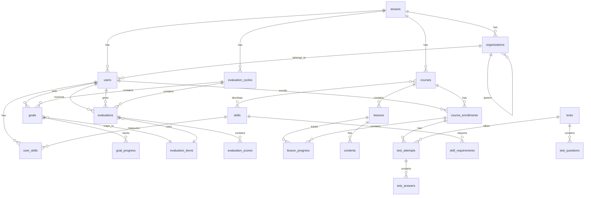
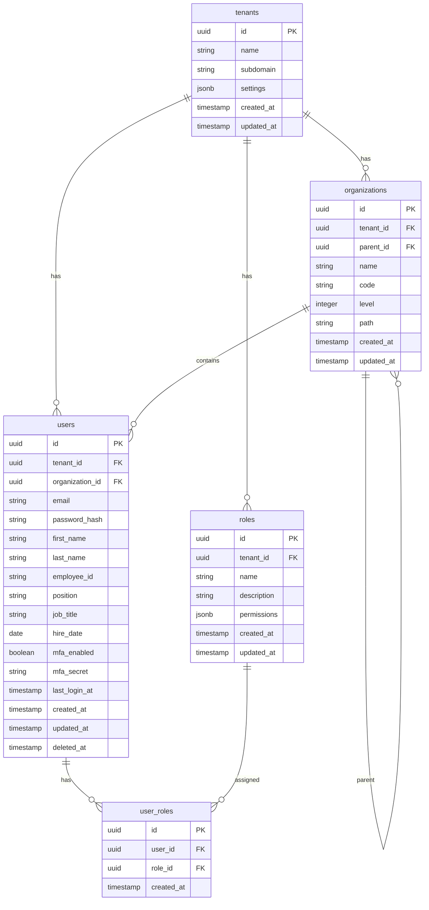
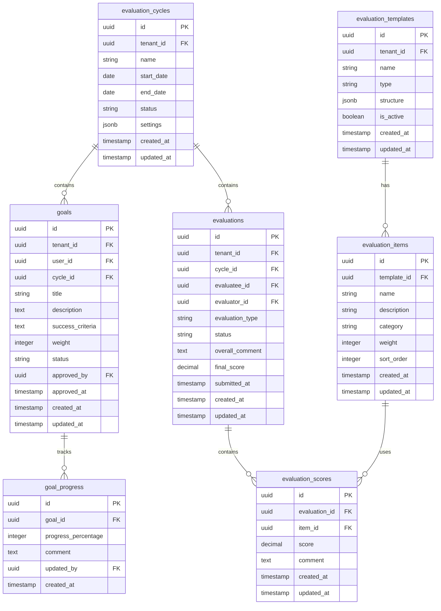
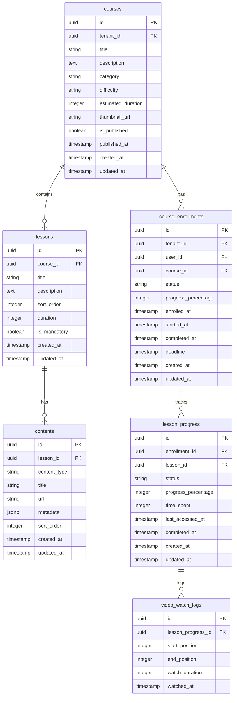
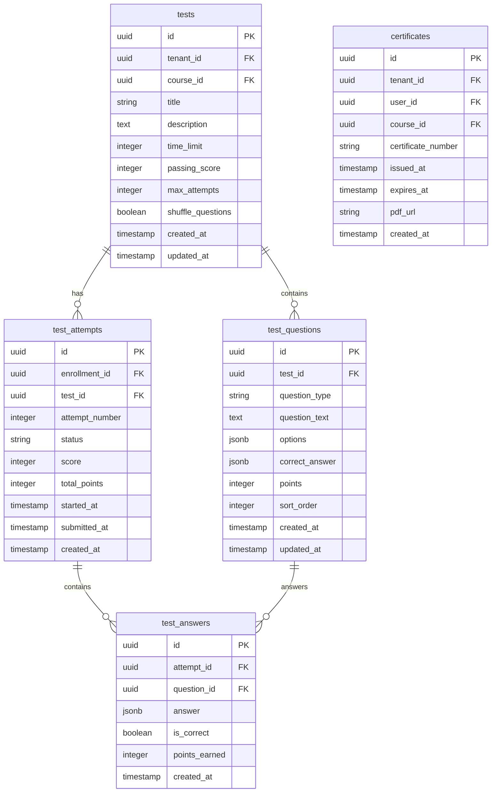
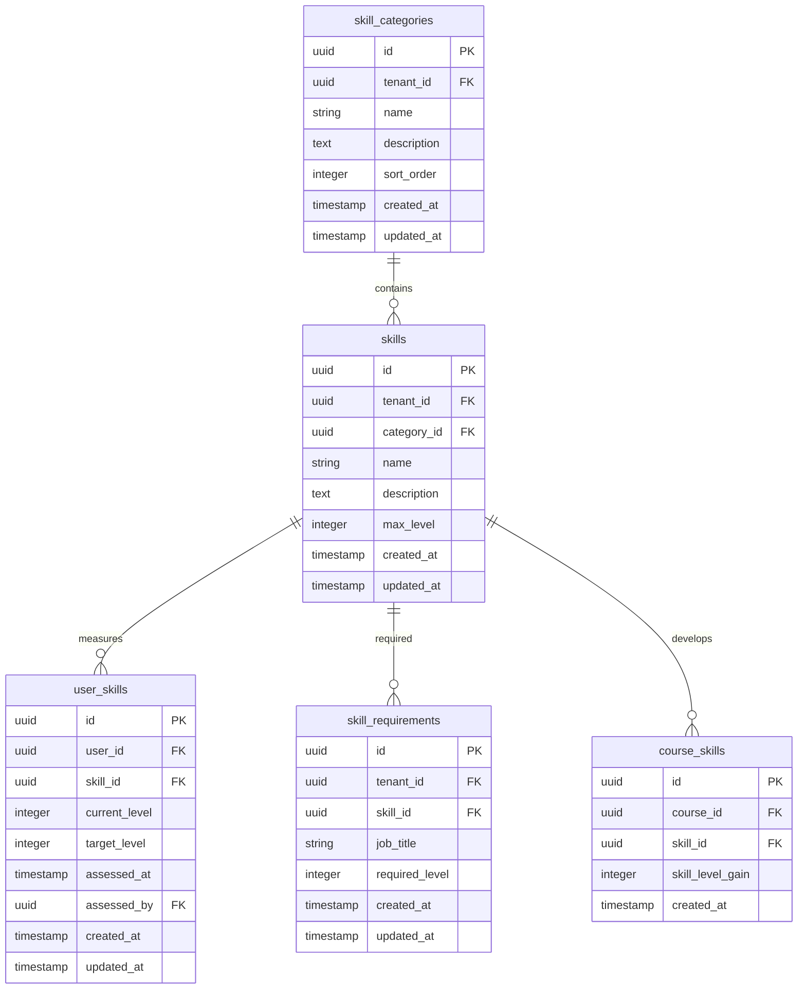

# データベース設計書

## 1. 概要

本ドキュメントは、人事評価・研修統合プラットフォームのデータベース設計を定義します。PostgreSQLを採用し、マルチテナント対応のスキーマ設計を行います。

---

## 2. 設計方針

### 2.1 マルチテナント戦略
- **テナント分離方式**: 共有スキーマ＋テナントID方式
- 全テーブルに`tenant_id`カラムを持つ
- Row Level Security (RLS) による厳格なデータ分離

### 2.2 命名規則
- テーブル名: スネークケース、複数形（例: `users`, `evaluation_cycles`）
- カラム名: スネークケース（例: `created_at`, `user_id`）
- 主キー: `id` (UUID)
- 外部キー: `{テーブル名単数形}_id`
- タイムスタンプ: `created_at`, `updated_at`, `deleted_at`

### 2.3 共通カラム
全テーブルに以下のカラムを含める:
- `id`: UUID（主キー）
- `tenant_id`: UUID（テナント識別）
- `created_at`: TIMESTAMP WITH TIME ZONE
- `updated_at`: TIMESTAMP WITH TIME ZONE
- `deleted_at`: TIMESTAMP WITH TIME ZONE（論理削除）

---

## 3. ER図

### 3.1 全体ER図



### 3.2 認証・ユーザー管理ER図



### 3.3 評価管理ER図



### 3.4 LMS ER図



### 3.5 テスト・アンケートER図



### 3.6 スキル管理ER図



---

## 4. テーブル定義詳細

### 4.1 tenants（テナント）

| カラム名 | データ型 | 制約 | 説明 |
|----------|----------|------|------|
| id | UUID | PK, NOT NULL | テナントID |
| name | VARCHAR(255) | NOT NULL | テナント名 |
| subdomain | VARCHAR(63) | UNIQUE, NOT NULL | サブドメイン |
| settings | JSONB | DEFAULT '{}' | テナント設定 |
| status | VARCHAR(20) | NOT NULL DEFAULT 'active' | 状態 |
| max_users | INTEGER | | 最大ユーザー数 |
| storage_limit_gb | INTEGER | | ストレージ上限(GB) |
| created_at | TIMESTAMPTZ | NOT NULL DEFAULT NOW() | 作成日時 |
| updated_at | TIMESTAMPTZ | NOT NULL DEFAULT NOW() | 更新日時 |

**インデックス:**
- PRIMARY KEY (id)
- UNIQUE (subdomain)

---

### 4.2 users（ユーザー）

| カラム名 | データ型 | 制約 | 説明 |
|----------|----------|------|------|
| id | UUID | PK, NOT NULL | ユーザーID |
| tenant_id | UUID | FK, NOT NULL | テナントID |
| organization_id | UUID | FK | 所属組織ID |
| email | VARCHAR(255) | NOT NULL | メールアドレス |
| password_hash | VARCHAR(255) | NOT NULL | パスワードハッシュ |
| first_name | VARCHAR(100) | NOT NULL | 名 |
| last_name | VARCHAR(100) | NOT NULL | 姓 |
| employee_id | VARCHAR(50) | | 社員番号 |
| position | VARCHAR(100) | | 役職 |
| job_title | VARCHAR(100) | | 職種 |
| hire_date | DATE | | 入社日 |
| manager_id | UUID | FK | 上司ユーザーID |
| mfa_enabled | BOOLEAN | DEFAULT FALSE | MFA有効フラグ |
| mfa_secret | VARCHAR(255) | | MFAシークレット |
| status | VARCHAR(20) | DEFAULT 'active' | 状態 |
| last_login_at | TIMESTAMPTZ | | 最終ログイン日時 |
| created_at | TIMESTAMPTZ | NOT NULL DEFAULT NOW() | 作成日時 |
| updated_at | TIMESTAMPTZ | NOT NULL DEFAULT NOW() | 更新日時 |
| deleted_at | TIMESTAMPTZ | | 削除日時 |

**インデックス:**
- PRIMARY KEY (id)
- UNIQUE (tenant_id, email)
- INDEX (tenant_id, organization_id)
- INDEX (tenant_id, manager_id)
- INDEX (tenant_id, employee_id)

**RLSポリシー:**
```sql
CREATE POLICY tenant_isolation ON users
  USING (tenant_id = current_setting('app.tenant_id')::UUID);
```

---

### 4.3 goals（目標）

| カラム名 | データ型 | 制約 | 説明 |
|----------|----------|------|------|
| id | UUID | PK, NOT NULL | 目標ID |
| tenant_id | UUID | FK, NOT NULL | テナントID |
| user_id | UUID | FK, NOT NULL | ユーザーID |
| cycle_id | UUID | FK, NOT NULL | 評価サイクルID |
| parent_goal_id | UUID | FK | 上位目標ID |
| title | VARCHAR(255) | NOT NULL | 目標タイトル |
| description | TEXT | | 目標詳細 |
| success_criteria | TEXT | | 達成基準 |
| weight | INTEGER | DEFAULT 0 | ウェイト(%) |
| status | VARCHAR(20) | DEFAULT 'draft' | 状態 |
| approved_by | UUID | FK | 承認者ID |
| approved_at | TIMESTAMPTZ | | 承認日時 |
| final_achievement | INTEGER | | 最終達成度(%) |
| created_at | TIMESTAMPTZ | NOT NULL DEFAULT NOW() | 作成日時 |
| updated_at | TIMESTAMPTZ | NOT NULL DEFAULT NOW() | 更新日時 |

**状態 (status):**
- draft: 下書き
- pending_approval: 承認待ち
- approved: 承認済み
- in_progress: 進行中
- completed: 完了

**インデックス:**
- PRIMARY KEY (id)
- INDEX (tenant_id, user_id, cycle_id)
- INDEX (tenant_id, status)

---

### 4.4 evaluations（評価）

| カラム名 | データ型 | 制約 | 説明 |
|----------|----------|------|------|
| id | UUID | PK, NOT NULL | 評価ID |
| tenant_id | UUID | FK, NOT NULL | テナントID |
| cycle_id | UUID | FK, NOT NULL | 評価サイクルID |
| evaluatee_id | UUID | FK, NOT NULL | 被評価者ID |
| evaluator_id | UUID | FK, NOT NULL | 評価者ID |
| evaluation_type | VARCHAR(50) | NOT NULL | 評価タイプ |
| status | VARCHAR(20) | DEFAULT 'pending' | 状態 |
| overall_comment | TEXT | | 総合コメント |
| final_score | DECIMAL(5,2) | | 最終スコア |
| submitted_at | TIMESTAMPTZ | | 提出日時 |
| created_at | TIMESTAMPTZ | NOT NULL DEFAULT NOW() | 作成日時 |
| updated_at | TIMESTAMPTZ | NOT NULL DEFAULT NOW() | 更新日時 |

**評価タイプ (evaluation_type):**
- self: 自己評価
- manager: 上司評価
- peer: 同僚評価
- subordinate: 部下評価

**状態 (status):**
- pending: 未着手
- in_progress: 入力中
- submitted: 提出済み
- approved: 承認済み

**インデックス:**
- PRIMARY KEY (id)
- INDEX (tenant_id, cycle_id, evaluatee_id)
- INDEX (tenant_id, evaluator_id, status)

---

### 4.5 courses（コース）

| カラム名 | データ型 | 制約 | 説明 |
|----------|----------|------|------|
| id | UUID | PK, NOT NULL | コースID |
| tenant_id | UUID | FK, NOT NULL | テナントID |
| title | VARCHAR(255) | NOT NULL | コースタイトル |
| description | TEXT | | コース説明 |
| category | VARCHAR(100) | | カテゴリ |
| difficulty | VARCHAR(20) | | 難易度 |
| estimated_duration | INTEGER | | 想定所要時間(分) |
| thumbnail_url | VARCHAR(500) | | サムネイルURL |
| is_published | BOOLEAN | DEFAULT FALSE | 公開フラグ |
| published_at | TIMESTAMPTZ | | 公開日時 |
| prerequisites | UUID[] | | 前提コースID配列 |
| tags | VARCHAR[] | | タグ配列 |
| created_by | UUID | FK | 作成者ID |
| created_at | TIMESTAMPTZ | NOT NULL DEFAULT NOW() | 作成日時 |
| updated_at | TIMESTAMPTZ | NOT NULL DEFAULT NOW() | 更新日時 |

**難易度 (difficulty):**
- beginner: 初級
- intermediate: 中級
- advanced: 上級

**インデックス:**
- PRIMARY KEY (id)
- INDEX (tenant_id, is_published)
- INDEX (tenant_id, category)
- GIN INDEX (tags)

---

### 4.6 course_enrollments（コース登録）

| カラム名 | データ型 | 制約 | 説明 |
|----------|----------|------|------|
| id | UUID | PK, NOT NULL | 登録ID |
| tenant_id | UUID | FK, NOT NULL | テナントID |
| user_id | UUID | FK, NOT NULL | ユーザーID |
| course_id | UUID | FK, NOT NULL | コースID |
| status | VARCHAR(20) | DEFAULT 'enrolled' | 状態 |
| progress_percentage | INTEGER | DEFAULT 0 | 進捗率(%) |
| enrolled_at | TIMESTAMPTZ | NOT NULL DEFAULT NOW() | 登録日時 |
| started_at | TIMESTAMPTZ | | 開始日時 |
| completed_at | TIMESTAMPTZ | | 完了日時 |
| deadline | TIMESTAMPTZ | | 受講期限 |
| assigned_by | UUID | FK | 割り当て者ID |
| total_time_spent | INTEGER | DEFAULT 0 | 総学習時間(秒) |
| created_at | TIMESTAMPTZ | NOT NULL DEFAULT NOW() | 作成日時 |
| updated_at | TIMESTAMPTZ | NOT NULL DEFAULT NOW() | 更新日時 |

**状態 (status):**
- enrolled: 登録済み
- in_progress: 受講中
- completed: 完了
- expired: 期限切れ

**インデックス:**
- PRIMARY KEY (id)
- UNIQUE (user_id, course_id)
- INDEX (tenant_id, user_id, status)
- INDEX (tenant_id, course_id)
- INDEX (deadline)

---

### 4.7 user_skills（ユーザースキル）

| カラム名 | データ型 | 制約 | 説明 |
|----------|----------|------|------|
| id | UUID | PK, NOT NULL | ID |
| user_id | UUID | FK, NOT NULL | ユーザーID |
| skill_id | UUID | FK, NOT NULL | スキルID |
| current_level | INTEGER | NOT NULL DEFAULT 0 | 現在レベル |
| target_level | INTEGER | | 目標レベル |
| assessed_at | TIMESTAMPTZ | | 評価日時 |
| assessed_by | UUID | FK | 評価者ID |
| evidence | JSONB | | エビデンス |
| created_at | TIMESTAMPTZ | NOT NULL DEFAULT NOW() | 作成日時 |
| updated_at | TIMESTAMPTZ | NOT NULL DEFAULT NOW() | 更新日時 |

**インデックス:**
- PRIMARY KEY (id)
- UNIQUE (user_id, skill_id)
- INDEX (skill_id)

---

## 5. データ整合性

### 5.1 外部キー制約

```sql
-- ユーザーの上司関係
ALTER TABLE users
  ADD CONSTRAINT fk_users_manager
  FOREIGN KEY (manager_id) REFERENCES users(id);

-- 目標の承認者
ALTER TABLE goals
  ADD CONSTRAINT fk_goals_approved_by
  FOREIGN KEY (approved_by) REFERENCES users(id);

-- 評価の評価者・被評価者
ALTER TABLE evaluations
  ADD CONSTRAINT fk_evaluations_evaluatee
  FOREIGN KEY (evaluatee_id) REFERENCES users(id);

ALTER TABLE evaluations
  ADD CONSTRAINT fk_evaluations_evaluator
  FOREIGN KEY (evaluator_id) REFERENCES users(id);
```

### 5.2 チェック制約

```sql
-- 目標のウェイトは0-100
ALTER TABLE goals
  ADD CONSTRAINT chk_goals_weight
  CHECK (weight >= 0 AND weight <= 100);

-- 進捗率は0-100
ALTER TABLE course_enrollments
  ADD CONSTRAINT chk_progress_percentage
  CHECK (progress_percentage >= 0 AND progress_percentage <= 100);

-- スキルレベルは正の値
ALTER TABLE user_skills
  ADD CONSTRAINT chk_skill_level
  CHECK (current_level >= 0 AND (target_level IS NULL OR target_level >= 0));
```

### 5.3 トリガー

```sql
-- updated_at自動更新
CREATE OR REPLACE FUNCTION update_updated_at()
RETURNS TRIGGER AS $$
BEGIN
  NEW.updated_at = NOW();
  RETURN NEW;
END;
$$ LANGUAGE plpgsql;

CREATE TRIGGER users_updated_at
  BEFORE UPDATE ON users
  FOR EACH ROW EXECUTE FUNCTION update_updated_at();
```

---

## 6. パフォーマンス最適化

### 6.1 パーティショニング

大量データが予想されるテーブルに対して、テナントIDまたは日時でパーティショニングを検討:

```sql
-- 監査ログの日付パーティショニング
CREATE TABLE audit_logs (
  id UUID,
  tenant_id UUID,
  user_id UUID,
  action VARCHAR(100),
  resource_type VARCHAR(100),
  resource_id UUID,
  details JSONB,
  ip_address INET,
  user_agent TEXT,
  created_at TIMESTAMPTZ
) PARTITION BY RANGE (created_at);

CREATE TABLE audit_logs_2025_01 PARTITION OF audit_logs
  FOR VALUES FROM ('2025-01-01') TO ('2025-02-01');
```

### 6.2 インデックス戦略

- 頻繁に検索されるカラムにB-treeインデックス
- 配列・JSONB検索にGINインデックス
- 全文検索が必要な場合はGiSTインデックス

```sql
-- 複合インデックス例
CREATE INDEX idx_enrollments_tenant_user_status
  ON course_enrollments(tenant_id, user_id, status);

-- GINインデックス例
CREATE INDEX idx_courses_tags ON courses USING GIN(tags);
```

---

## 7. バックアップ・リカバリ

### 7.1 バックアップ戦略
- **フルバックアップ**: 日次（午前2時）
- **増分バックアップ**: 時間次
- **トランザクションログ**: 継続的アーカイブ（WAL）
- **保持期間**: 30日間

### 7.2 リカバリ手順
1. 最新のフルバックアップからリストア
2. 増分バックアップを適用
3. WALログを再生してポイントインタイムリカバリ

---

## 8. マイグレーション戦略

### 8.1 ツール
- **Prisma Migrate** または **TypeORM Migrations**を使用
- バージョン管理されたマイグレーションファイル

### 8.2 ルール
- ダウンタイムを最小化する段階的マイグレーション
- ロールバック可能な設計
- 本番適用前のステージング環境でのテスト必須

---

## 9. 変更履歴

| バージョン | 日付 | 変更内容 | 変更者 |
|------------|------|----------|--------|
| 1.0 | 2025-11-17 | 初版作成 | Claude |
