# システムアーキテクチャ設計書

## 1. 概要

本ドキュメントは、人事評価・研修統合プラットフォームのシステムアーキテクチャを定義します。スケーラビリティ、可用性、保守性を考慮したクラウドネイティブな設計を行います。

---

## 2. アーキテクチャ概要

### 2.1 アーキテクチャスタイル
- **マイクロサービスアーキテクチャ**
- 各サービスが独立してデプロイ・スケーリング可能
- サービス間は非同期メッセージングとREST APIで通信

### 2.2 設計原則
1. **Single Responsibility**: 各サービスは単一の責務を持つ
2. **Loose Coupling**: サービス間の依存を最小化
3. **High Cohesion**: 関連機能を同一サービス内に配置
4. **Resilience**: 障害に強い設計
5. **Observability**: 監視・ログ・トレーシングの充実

---

## 3. 全体アーキテクチャ図

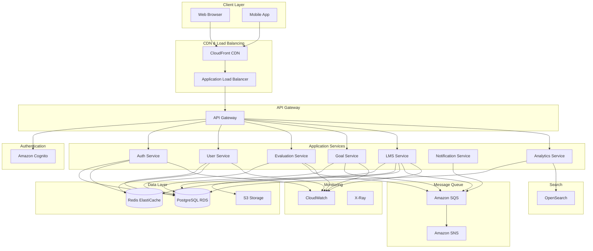

---

## 4. 技術スタック詳細

### 4.1 フロントエンド

| 技術 | バージョン | 用途 |
|------|-----------|------|
| Next.js | 14.x | Reactフレームワーク |
| TypeScript | 5.x | 型安全なJavaScript |
| Tailwind CSS | 3.x | ユーティリティファーストCSS |
| React Query | 5.x | サーバー状態管理 |
| Zustand | 4.x | クライアント状態管理 |
| Chart.js | 4.x | グラフ描画 |
| React Hook Form | 7.x | フォーム管理 |
| Zod | 3.x | バリデーション |

### 4.2 バックエンド

| 技術 | バージョン | 用途 |
|------|-----------|------|
| Node.js | 20.x LTS | ランタイム |
| TypeScript | 5.x | 型安全なJavaScript |
| NestJS | 10.x | バックエンドフレームワーク |
| Prisma | 5.x | ORM |
| Jest | 29.x | テストフレームワーク |

### 4.3 インフラストラクチャ（AWS）

| サービス | 用途 |
|----------|------|
| ECS Fargate | コンテナオーケストレーション |
| Application Load Balancer | ロードバランシング |
| API Gateway | API管理 |
| CloudFront | CDN |
| S3 | オブジェクトストレージ |
| RDS (PostgreSQL) | リレーショナルデータベース |
| ElastiCache (Redis) | キャッシュ |
| SQS | メッセージキュー |
| SNS | 通知サービス |
| Cognito | 認証・認可 |
| CloudWatch | モニタリング |
| X-Ray | 分散トレーシング |
| Secrets Manager | シークレット管理 |
| KMS | 暗号化キー管理 |

### 4.4 開発・運用ツール

| ツール | 用途 |
|--------|------|
| GitHub | ソースコード管理 |
| GitHub Actions | CI/CD |
| Docker | コンテナ化 |
| Terraform | Infrastructure as Code |
| Datadog / New Relic | APM（オプション） |

---

## 5. マイクロサービス設計

### 5.1 サービス一覧

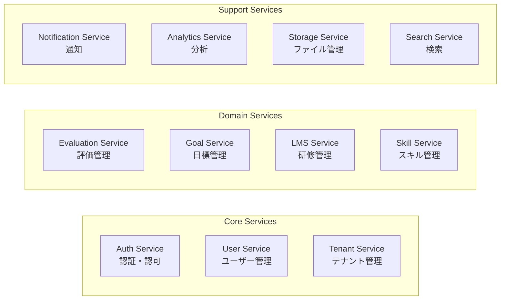

### 5.2 各サービスの責務

#### Auth Service（認証・認可サービス）
- **責務**: ユーザー認証、トークン管理、権限管理
- **技術**: NestJS + Passport.js + JWT
- **データ**: sessions, tokens, permissions
- **依存**: Cognito, Redis

#### User Service（ユーザー管理サービス）
- **責務**: ユーザーCRUD、組織管理、ロール管理
- **技術**: NestJS + Prisma
- **データ**: users, organizations, roles
- **依存**: PostgreSQL, Redis

#### Evaluation Service（評価管理サービス）
- **責務**: 評価サイクル管理、評価入力、スコア計算
- **技術**: NestJS + Prisma
- **データ**: evaluations, evaluation_scores, evaluation_cycles
- **依存**: PostgreSQL, SQS

#### Goal Service（目標管理サービス）
- **責務**: 目標設定、進捗管理、承認ワークフロー
- **技術**: NestJS + Prisma
- **データ**: goals, goal_progress
- **依存**: PostgreSQL, SQS

#### LMS Service（研修管理サービス）
- **責務**: コース管理、受講管理、進捗追跡
- **技術**: NestJS + Prisma
- **データ**: courses, enrollments, lessons, progress
- **依存**: PostgreSQL, S3, Redis, SQS

#### Notification Service（通知サービス）
- **責務**: メール通知、アプリ内通知、プッシュ通知
- **技術**: NestJS + SES
- **データ**: notifications, notification_preferences
- **依存**: SQS, SNS, SES

#### Analytics Service（分析サービス）
- **責務**: レポート生成、ダッシュボード、データ集計
- **技術**: NestJS + OpenSearch
- **データ**: aggregated metrics
- **依存**: PostgreSQL, OpenSearch

#### Storage Service（ファイル管理サービス）
- **責務**: ファイルアップロード、動画配信、署名付きURL
- **技術**: NestJS + S3
- **データ**: file metadata
- **依存**: S3, CloudFront

---

## 6. サービス間通信

### 6.1 同期通信（REST API）

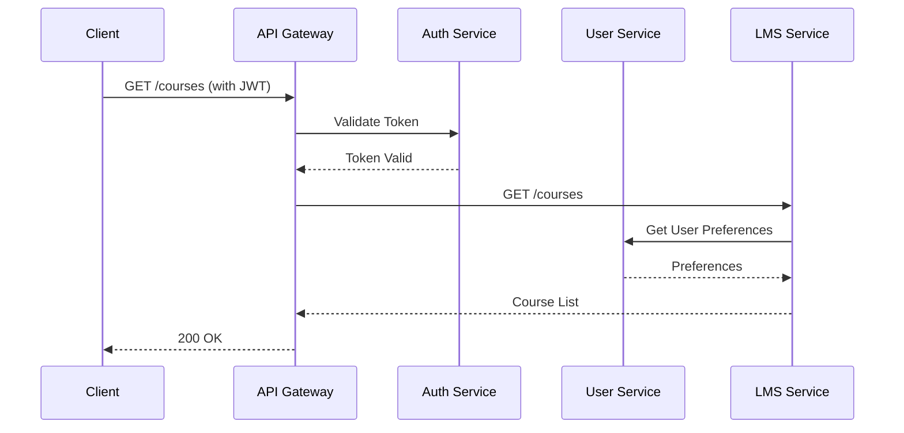

### 6.2 非同期通信（イベント駆動）

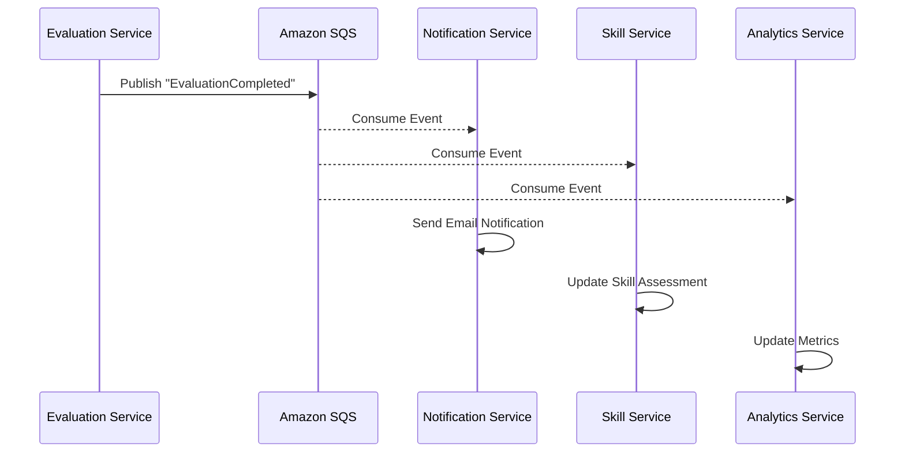

### 6.3 イベントカタログ

| イベント名 | 発行元 | 消費者 | ペイロード |
|-----------|--------|--------|-----------|
| UserCreated | User Service | Notification, LMS | userId, tenantId, email |
| GoalApproved | Goal Service | Notification, Analytics | goalId, userId, approverId |
| EvaluationSubmitted | Evaluation Service | Notification, Analytics | evaluationId, type |
| EvaluationCompleted | Evaluation Service | Notification, Skill, Analytics | evaluationId, scores |
| CourseCompleted | LMS Service | Notification, Skill, Analytics | enrollmentId, courseId |
| TestPassed | LMS Service | Notification, Analytics | attemptId, score |

---

## 7. データアーキテクチャ

### 7.1 データ配置戦略

```mermaid
graph TB
    subgraph "Primary Database"
        PG[PostgreSQL RDS<br/>Multi-AZ]
    end

    subgraph "Cache Layer"
        Redis[Redis ElastiCache<br/>Cluster Mode]
    end

    subgraph "Object Storage"
        S3_Media[S3 - Media Bucket<br/>動画・ドキュメント]
        S3_Backup[S3 - Backup Bucket<br/>バックアップ]
    end

    subgraph "Search Index"
        OS[OpenSearch<br/>全文検索]
    end

    subgraph "Services"
        Services[Microservices]
    end

    Services --> PG
    Services --> Redis
    Services --> S3_Media
    Services --> OS
    PG --> S3_Backup
```

### 7.2 キャッシング戦略

| データ種別 | キャッシュ先 | TTL | 無効化戦略 |
|-----------|-------------|-----|-----------|
| セッション情報 | Redis | 24h | 明示的削除 |
| ユーザープロフィール | Redis | 1h | Write-through |
| コースメタデータ | Redis | 6h | TTL + 手動 |
| 評価テンプレート | Redis | 24h | TTL + 手動 |
| APIレスポンス | CloudFront | 5m | TTL |

### 7.3 データ同期パターン

**Saga Pattern for Distributed Transactions:**

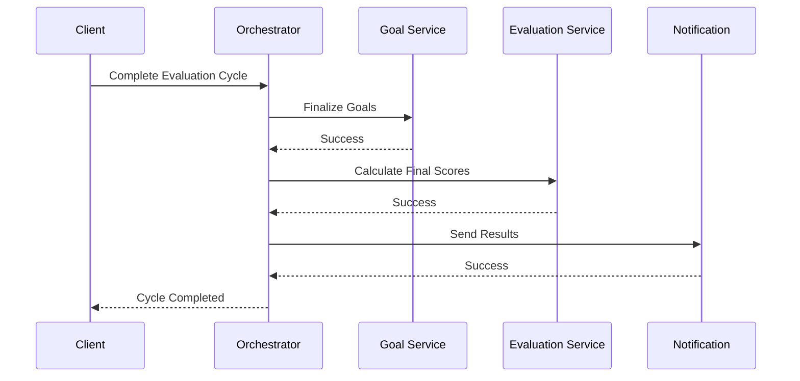

---

## 8. インフラストラクチャ設計

### 8.1 AWS構成図

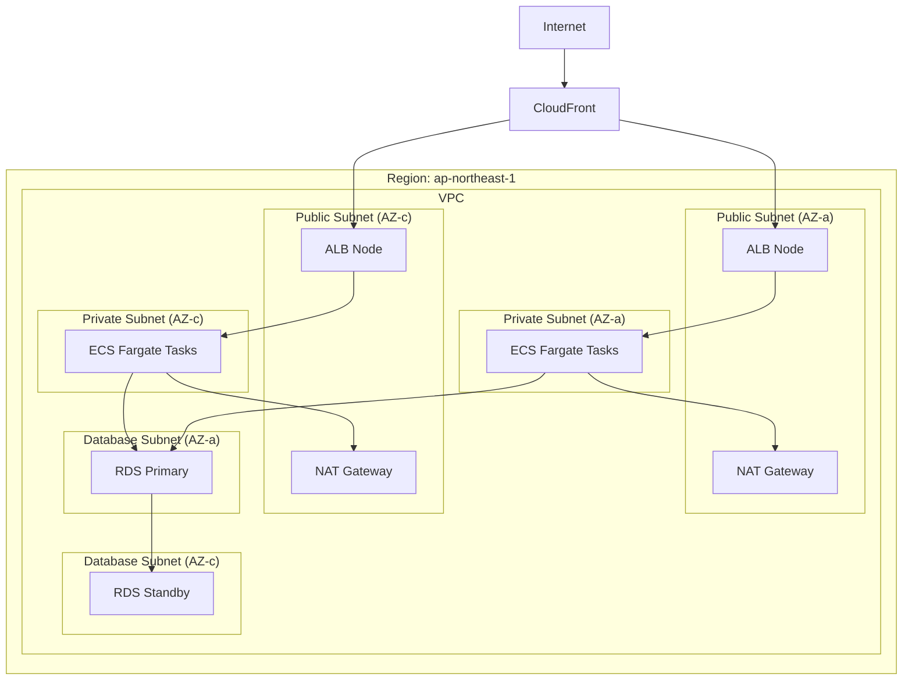

### 8.2 ネットワーク設計

| サブネット | CIDR | 用途 |
|-----------|------|------|
| Public-a | 10.0.1.0/24 | NAT Gateway, ALB |
| Public-c | 10.0.2.0/24 | NAT Gateway, ALB |
| Private-a | 10.0.10.0/24 | ECS Tasks |
| Private-c | 10.0.11.0/24 | ECS Tasks |
| Database-a | 10.0.20.0/24 | RDS |
| Database-c | 10.0.21.0/24 | RDS |

### 8.3 セキュリティグループ

| Security Group | Inbound Rules | Outbound Rules |
|----------------|---------------|----------------|
| ALB-SG | 443 from 0.0.0.0/0 | All to ECS-SG |
| ECS-SG | 3000 from ALB-SG | All to 0.0.0.0/0 |
| RDS-SG | 5432 from ECS-SG | None |
| Redis-SG | 6379 from ECS-SG | None |

---

## 9. スケーリング戦略

### 9.1 水平スケーリング

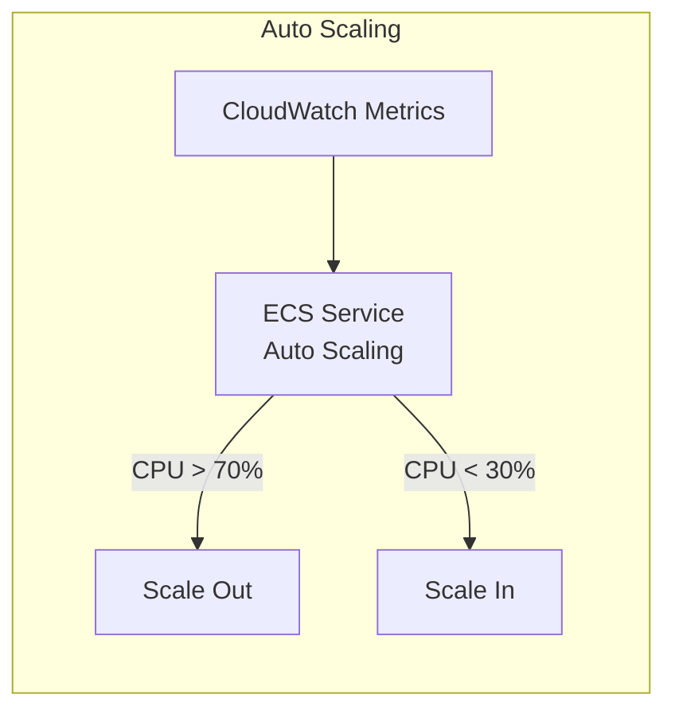

**Auto Scaling設定:**
```yaml
Service: LMS Service
Min Tasks: 2
Max Tasks: 20
Target CPU: 70%
Scale Out Cooldown: 60s
Scale In Cooldown: 300s
```

### 9.2 データベーススケーリング

- **Read Replicas**: 読み取り負荷分散（最大5台）
- **インスタンスサイズ**: 必要に応じて垂直スケール
- **Connection Pooling**: PgBouncer使用

### 9.3 キャッシュスケーリング

- **Redis Cluster Mode**: シャーディングによる水平スケール
- **レプリケーション**: 読み取り負荷分散

---

## 10. デプロイメント戦略

### 10.1 CI/CDパイプライン

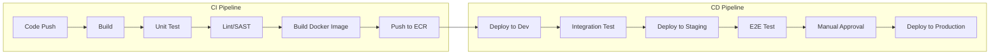

### 10.2 Blue-Greenデプロイメント

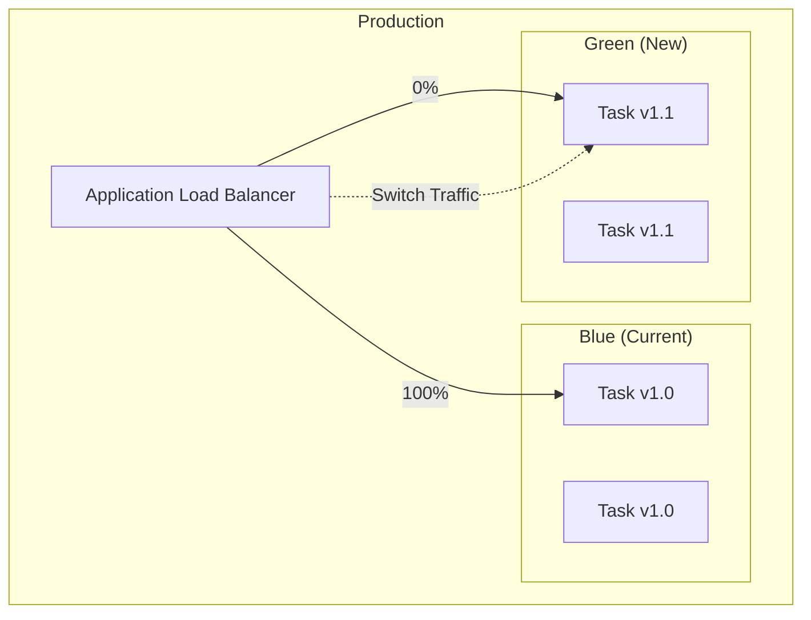

### 10.3 ロールバック手順

1. CloudWatch Alarmsによる異常検知
2. 自動ロールバックトリガー
3. 前バージョンのTask Definitionへの切り戻し
4. 5分以内の完全復旧

---

## 11. 監視・運用

### 11.1 監視項目

| カテゴリ | メトリクス | 閾値 | アラート |
|----------|-----------|------|---------|
| アプリケーション | Response Time P95 | > 2s | Warning |
| アプリケーション | Error Rate | > 1% | Critical |
| インフラ | CPU使用率 | > 80% | Warning |
| インフラ | メモリ使用率 | > 85% | Warning |
| データベース | Connection Count | > 80% | Warning |
| データベース | Replication Lag | > 10s | Critical |

### 11.2 ログ管理

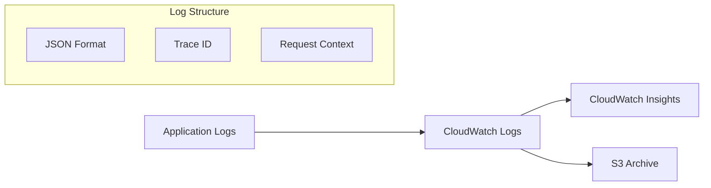

**ログフォーマット:**
```json
{
  "timestamp": "2025-01-01T00:00:00.000Z",
  "level": "INFO",
  "service": "lms-service",
  "traceId": "abc123",
  "tenantId": "tenant-001",
  "userId": "user-001",
  "message": "Course enrollment completed",
  "metadata": {
    "courseId": "course-001",
    "duration": 150
  }
}
```

### 11.3 アラート・インシデント対応

1. **L1**: CloudWatchアラーム → PagerDuty
2. **L2**: オンコールエンジニア対応
3. **L3**: エスカレーション（15分以内）
4. **Post-mortem**: インシデント後の振り返り

---

## 12. 災害復旧（DR）

### 12.1 DR戦略

- **RPO (Recovery Point Objective)**: 1時間
- **RTO (Recovery Time Objective)**: 4時間
- **戦略**: Pilot Light（最小限のインフラを常時稼働）

### 12.2 DR構成

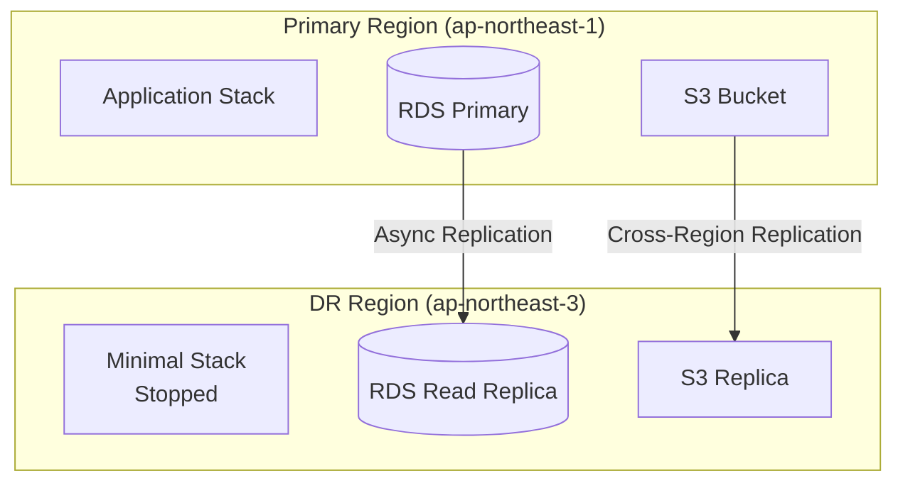

### 12.3 フェイルオーバー手順

1. プライマリリージョンの障害検知
2. Route 53ヘルスチェック失敗
3. DRリージョンのRDSをプライマリに昇格
4. DRリージョンのアプリケーションを起動
5. DNSフェイルオーバー実行

---

## 13. 変更履歴

| バージョン | 日付 | 変更内容 | 変更者 |
|------------|------|----------|--------|
| 1.0 | 2025-11-17 | 初版作成 | Claude |
