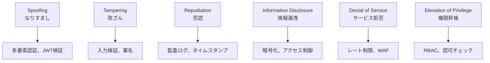
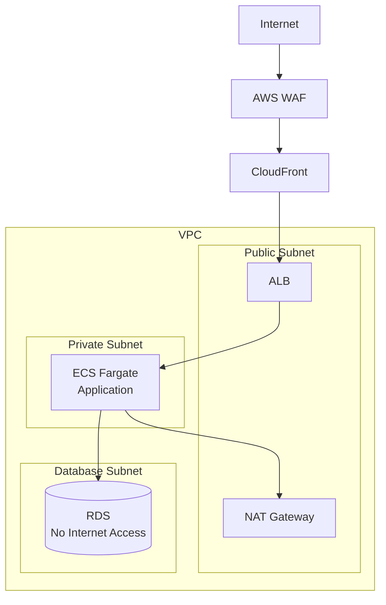

# セキュリティ設計書

## 1. 概要

本ドキュメントは、人事評価・研修統合プラットフォームのセキュリティ設計を定義します。個人情報や評価情報など機密性の高いデータを扱うため、多層的な防御策を講じます。

---

## 2. セキュリティ設計原則

### 2.1 基本原則
1. **Defense in Depth（多層防御）**: 複数のセキュリティレイヤーを設置
2. **Least Privilege（最小権限）**: 必要最小限の権限のみ付与
3. **Zero Trust**: 全てのアクセスを検証
4. **Security by Design**: 設計段階からセキュリティを考慮
5. **Privacy by Default**: プライバシー保護をデフォルトに

### 2.2 準拠規格・法令
- 個人情報保護法
- JIS Q 15001（プライバシーマーク）
- ISO/IEC 27001（情報セキュリティマネジメント）
- OWASP Top 10
- GDPR（将来の海外展開を考慮）

---

## 3. 脅威モデル

### 3.1 想定される脅威

| 脅威カテゴリ | 具体的脅威 | リスクレベル |
|------------|-----------|-------------|
| **不正アクセス** | ブルートフォース攻撃、クレデンシャルスタッフィング | 高 |
| **データ漏洩** | SQLインジェクション、内部不正、設定ミス | 高 |
| **サービス妨害** | DDoS攻撃、リソース枯渇攻撃 | 中 |
| **セッションハイジャック** | セッション固定、XSS経由 | 高 |
| **権限昇格** | IDOR、ロールバイパス | 高 |
| **データ改ざん** | CSRF、不正なAPI呼び出し | 中 |

### 3.2 STRIDE分析



---

## 4. 認証セキュリティ

### 4.1 パスワードポリシー

```typescript
const passwordPolicy = {
  minLength: 12,
  maxLength: 128,
  requireUppercase: true,
  requireLowercase: true,
  requireNumbers: true,
  requireSpecialChars: true,
  prohibitCommonPasswords: true,
  prohibitUserInfo: true, // メールアドレスや名前を含まない
  expirationDays: 90,
  historyCount: 12, // 過去12回分は再利用不可
  maxFailedAttempts: 5,
  lockoutDurationMinutes: 30
};
```

### 4.2 パスワードハッシュ化

```typescript
import bcrypt from 'bcrypt';

const SALT_ROUNDS = 12;

async function hashPassword(password: string): Promise<string> {
  return bcrypt.hash(password, SALT_ROUNDS);
}

async function verifyPassword(password: string, hash: string): Promise<boolean> {
  return bcrypt.compare(password, hash);
}
```

### 4.3 多要素認証（MFA）

**サポートする認証方式:**
1. **TOTP（Time-based One-Time Password）**
   - Google Authenticator、Microsoft Authenticator対応
   - RFC 6238準拠

2. **SMS認証**（オプション）
   - バックアップ手段として
   - SIMスワップ攻撃リスクを考慮

3. **バックアップコード**
   - 10個の一次使用コード
   - 暗号化保存

```typescript
// TOTP生成
import speakeasy from 'speakeasy';

const secret = speakeasy.generateSecret({
  name: 'HR Platform',
  issuer: 'YourCompany',
  length: 32
});

// TOTP検証
const verified = speakeasy.totp.verify({
  secret: user.mfaSecret,
  encoding: 'base32',
  token: userToken,
  window: 1 // 30秒の許容範囲
});
```

### 4.4 JWT設計

```typescript
// Access Token (短寿命)
const accessTokenPayload = {
  sub: userId,
  tid: tenantId,
  roles: ['employee', 'manager'],
  permissions: ['goal:write', 'evaluation:read'],
  iat: Math.floor(Date.now() / 1000),
  exp: Math.floor(Date.now() / 1000) + 3600, // 1時間
  jti: uuidv4() // 一意識別子
};

// Refresh Token (長寿命)
const refreshTokenPayload = {
  sub: userId,
  tid: tenantId,
  iat: Math.floor(Date.now() / 1000),
  exp: Math.floor(Date.now() / 1000) + 604800, // 7日
  jti: uuidv4()
};

// 署名アルゴリズム: RS256 (RSA + SHA-256)
const token = jwt.sign(payload, privateKey, { algorithm: 'RS256' });
```

### 4.5 セッション管理

- **Redis**でセッション情報を一元管理
- セッションタイムアウト: 30分（非アクティブ時）
- 絶対タイムアウト: 12時間
- 同時セッション制限: 3デバイスまで
- 強制ログアウト機能

```typescript
interface SessionData {
  userId: string;
  tenantId: string;
  deviceInfo: string;
  ipAddress: string;
  createdAt: number;
  lastActivityAt: number;
  expiresAt: number;
}
```

### 4.6 ブルートフォース対策

```typescript
// レート制限設定
const loginRateLimiter = rateLimit({
  windowMs: 15 * 60 * 1000, // 15分
  max: 5, // 5回まで
  keyGenerator: (req) => req.ip,
  handler: (req, res) => {
    // アカウントロック処理
    lockAccount(req.body.email);
    res.status(429).json({
      error: 'Too many login attempts. Account locked for 30 minutes.'
    });
  }
});

// 失敗回数カウント
async function trackLoginAttempt(email: string, success: boolean) {
  if (!success) {
    const attempts = await incrementFailedAttempts(email);
    if (attempts >= 5) {
      await lockAccount(email, 30 * 60); // 30分ロック
      await sendAccountLockNotification(email);
    }
  } else {
    await resetFailedAttempts(email);
  }
}
```

---

## 5. 認可（Authorization）

### 5.1 RBAC（Role-Based Access Control）

```typescript
// ロール定義
const roles = {
  SYSTEM_ADMIN: {
    name: 'システム管理者',
    permissions: ['*'] // 全権限
  },
  TENANT_ADMIN: {
    name: 'テナント管理者',
    permissions: [
      'user:*',
      'organization:*',
      'role:*',
      'settings:*',
      'audit:read'
    ]
  },
  HR_MANAGER: {
    name: '人事担当者',
    permissions: [
      'evaluation:*',
      'course:*',
      'report:*',
      'user:read'
    ]
  },
  MANAGER: {
    name: '管理職',
    permissions: [
      'goal:approve',
      'evaluation:write',
      'team:read',
      'report:team'
    ]
  },
  EMPLOYEE: {
    name: '一般従業員',
    permissions: [
      'goal:own',
      'evaluation:self',
      'course:enroll',
      'profile:own'
    ]
  }
};
```

### 5.2 権限チェックミドルウェア

```typescript
// 権限チェックデコレータ
@UseGuards(AuthGuard, PermissionGuard)
@RequirePermissions('evaluation:write')
@Controller('evaluations')
export class EvaluationController {
  @Post()
  async createEvaluation(@Body() dto: CreateEvaluationDto) {
    // ...
  }
}

// リソースレベル認可
async function checkResourceAccess(
  userId: string,
  resourceType: string,
  resourceId: string,
  action: string
): Promise<boolean> {
  // 1. ユーザーのロールと権限を取得
  const userPermissions = await getUserPermissions(userId);

  // 2. アクション権限をチェック
  if (!hasPermission(userPermissions, `${resourceType}:${action}`)) {
    return false;
  }

  // 3. リソース所有権をチェック（該当する場合）
  if (action === 'own') {
    const resource = await getResource(resourceType, resourceId);
    return resource.userId === userId;
  }

  // 4. 組織階層に基づくアクセス制御
  const canAccess = await checkOrganizationAccess(userId, resourceId);
  return canAccess;
}
```

### 5.3 データスコープ制御

```typescript
// Row Level Security (RLS)
// PostgreSQLでの実装
CREATE POLICY tenant_isolation ON users
  FOR ALL
  USING (tenant_id = current_setting('app.tenant_id')::UUID);

CREATE POLICY manager_can_see_team ON goals
  FOR SELECT
  USING (
    user_id = current_setting('app.user_id')::UUID
    OR
    EXISTS (
      SELECT 1 FROM users u
      WHERE u.id = goals.user_id
      AND u.manager_id = current_setting('app.user_id')::UUID
    )
  );
```

---

## 6. 通信セキュリティ

### 6.1 TLS設定

```nginx
# Nginx設定
server {
    listen 443 ssl http2;

    # TLS 1.3のみ許可（1.2も許容する場合は追加）
    ssl_protocols TLSv1.3 TLSv1.2;

    # 強力な暗号スイートのみ
    ssl_ciphers 'ECDHE-ECDSA-AES256-GCM-SHA384:ECDHE-RSA-AES256-GCM-SHA384';
    ssl_prefer_server_ciphers on;

    # HSTS (1年間)
    add_header Strict-Transport-Security "max-age=31536000; includeSubDomains; preload" always;

    # 証明書
    ssl_certificate /path/to/fullchain.pem;
    ssl_certificate_key /path/to/privkey.pem;

    # OCSP Stapling
    ssl_stapling on;
    ssl_stapling_verify on;
}
```

### 6.2 セキュリティヘッダー

```typescript
// Helmet.js設定
app.use(helmet({
  contentSecurityPolicy: {
    directives: {
      defaultSrc: ["'self'"],
      scriptSrc: ["'self'", "'unsafe-inline'"], // 必要最小限
      styleSrc: ["'self'", "'unsafe-inline'"],
      imgSrc: ["'self'", "data:", "https://cdn.example.com"],
      connectSrc: ["'self'", "https://api.example.com"],
      fontSrc: ["'self'", "https://fonts.googleapis.com"],
      objectSrc: ["'none'"],
      mediaSrc: ["'self'", "https://cdn.example.com"],
      frameSrc: ["'none'"]
    }
  },
  crossOriginEmbedderPolicy: true,
  crossOriginOpenerPolicy: { policy: "same-origin" },
  crossOriginResourcePolicy: { policy: "same-origin" },
  dnsPrefetchControl: { allow: false },
  frameguard: { action: "deny" },
  hsts: {
    maxAge: 31536000,
    includeSubDomains: true,
    preload: true
  },
  ieNoOpen: true,
  noSniff: true,
  originAgentCluster: true,
  permittedCrossDomainPolicies: { permittedPolicies: "none" },
  referrerPolicy: { policy: "strict-origin-when-cross-origin" },
  xssFilter: true
}));
```

### 6.3 CORS設定

```typescript
const corsOptions = {
  origin: [
    'https://app.platform.example.com',
    /\.platform\.example\.com$/
  ],
  methods: ['GET', 'POST', 'PUT', 'PATCH', 'DELETE'],
  allowedHeaders: ['Content-Type', 'Authorization', 'X-Request-ID'],
  exposedHeaders: ['X-RateLimit-Limit', 'X-RateLimit-Remaining'],
  credentials: true,
  maxAge: 86400 // 24時間
};

app.use(cors(corsOptions));
```

---

## 7. アプリケーションセキュリティ

### 7.1 入力検証

```typescript
// Zodによるスキーマ検証
const createGoalSchema = z.object({
  title: z.string()
    .min(1, '目標タイトルは必須です')
    .max(255, '255文字以内で入力してください')
    .refine(val => !containsMaliciousPattern(val), 'Invalid characters'),
  description: z.string()
    .max(5000)
    .transform(sanitizeHtml),
  weight: z.number()
    .int()
    .min(0)
    .max(100),
  cycleId: z.string().uuid()
});

// SQLインジェクション対策（Prisma ORM）
const user = await prisma.user.findFirst({
  where: {
    email: userInput // 自動的にパラメータ化される
  }
});

// XSS対策
import DOMPurify from 'dompurify';

function sanitizeUserInput(input: string): string {
  return DOMPurify.sanitize(input, {
    ALLOWED_TAGS: ['b', 'i', 'em', 'strong', 'p', 'br'],
    ALLOWED_ATTR: []
  });
}
```

### 7.2 出力エンコーディング

```typescript
// Reactでの自動エスケープ
function UserComment({ comment }: { comment: string }) {
  // 自動的にHTMLエスケープされる
  return <p>{comment}</p>;
}

// 意図的にHTMLを出力する場合（要注意）
function RichTextContent({ html }: { html: string }) {
  const sanitizedHtml = DOMPurify.sanitize(html);
  return <div dangerouslySetInnerHTML={{ __html: sanitizedHtml }} />;
}

// JSON出力のエスケープ
app.use((req, res, next) => {
  const originalJson = res.json.bind(res);
  res.json = (body) => {
    // JSONPインジェクション対策
    return originalJson(body);
  };
  next();
});
```

### 7.3 CSRF対策

```typescript
// CSRFトークンの生成と検証
import csrf from 'csurf';

const csrfProtection = csrf({
  cookie: {
    httpOnly: true,
    secure: process.env.NODE_ENV === 'production',
    sameSite: 'strict'
  }
});

// SameSite Cookie属性
res.cookie('session', sessionId, {
  httpOnly: true,
  secure: true,
  sameSite: 'strict',
  maxAge: 3600000
});

// Double Submit Cookie Pattern
app.use((req, res, next) => {
  const token = req.cookies['csrf-token'];
  const headerToken = req.headers['x-csrf-token'];

  if (token !== headerToken) {
    return res.status(403).json({ error: 'CSRF token mismatch' });
  }
  next();
});
```

### 7.4 安全なファイルアップロード

```typescript
// ファイルアップロード制限
const uploadMiddleware = multer({
  storage: multer.memoryStorage(),
  limits: {
    fileSize: 100 * 1024 * 1024, // 100MB
    files: 1
  },
  fileFilter: (req, file, cb) => {
    // MIMEタイプチェック
    const allowedMimes = [
      'video/mp4',
      'video/webm',
      'application/pdf',
      'image/jpeg',
      'image/png'
    ];

    if (allowedMimes.includes(file.mimetype)) {
      cb(null, true);
    } else {
      cb(new Error('Invalid file type'));
    }
  }
});

// マジックバイトによるファイル検証
import fileType from 'file-type';

async function validateFileContent(buffer: Buffer): Promise<boolean> {
  const type = await fileType.fromBuffer(buffer);

  if (!type) {
    return false;
  }

  const allowedTypes = ['mp4', 'webm', 'pdf', 'jpg', 'png'];
  return allowedTypes.includes(type.ext);
}

// ウイルススキャン
async function scanForViruses(filePath: string): Promise<boolean> {
  // ClamAVなどのウイルススキャナーを利用
  const result = await clamav.scanFile(filePath);
  return result.isClean;
}
```

---

## 8. データセキュリティ

### 8.1 保存時暗号化

```typescript
// データベース暗号化（RDS）
// - AES-256暗号化が自動適用
// - AWS KMSによるキー管理

// アプリケーションレベル暗号化（機密データ）
import crypto from 'crypto';

const ALGORITHM = 'aes-256-gcm';

function encryptSensitiveData(plaintext: string, key: Buffer): EncryptedData {
  const iv = crypto.randomBytes(16);
  const cipher = crypto.createCipheriv(ALGORITHM, key, iv);

  let encrypted = cipher.update(plaintext, 'utf8', 'hex');
  encrypted += cipher.final('hex');

  const authTag = cipher.getAuthTag();

  return {
    iv: iv.toString('hex'),
    encryptedData: encrypted,
    authTag: authTag.toString('hex')
  };
}

function decryptSensitiveData(encryptedData: EncryptedData, key: Buffer): string {
  const decipher = crypto.createDecipheriv(
    ALGORITHM,
    key,
    Buffer.from(encryptedData.iv, 'hex')
  );

  decipher.setAuthTag(Buffer.from(encryptedData.authTag, 'hex'));

  let decrypted = decipher.update(encryptedData.encryptedData, 'hex', 'utf8');
  decrypted += decipher.final('utf8');

  return decrypted;
}

// 機密データフィールドの暗号化
const sensitiveFields = [
  'evaluation_scores.comment',
  'evaluations.overall_comment',
  'users.emergency_contact'
];
```

### 8.2 データマスキング

```typescript
// 表示用マスキング
function maskEmail(email: string): string {
  const [local, domain] = email.split('@');
  return `${local[0]}***@${domain}`;
}

function maskEmployeeId(id: string): string {
  return `***${id.slice(-4)}`;
}

// ログ出力時のマスキング
const maskSensitiveData = (obj: any): any => {
  const sensitiveKeys = ['password', 'token', 'secret', 'creditCard'];

  return Object.keys(obj).reduce((acc, key) => {
    if (sensitiveKeys.some(sk => key.toLowerCase().includes(sk))) {
      acc[key] = '***REDACTED***';
    } else if (typeof obj[key] === 'object') {
      acc[key] = maskSensitiveData(obj[key]);
    } else {
      acc[key] = obj[key];
    }
    return acc;
  }, {});
};
```

### 8.3 データ保持ポリシー

| データ種別 | 保持期間 | 削除方法 |
|-----------|---------|---------|
| 評価データ | 10年 | 論理削除後、期間経過で物理削除 |
| 研修受講履歴 | 7年 | 論理削除後、期間経過で物理削除 |
| 監査ログ | 5年 | アーカイブ後削除 |
| セッションログ | 90日 | 自動削除 |
| 一時ファイル | 24時間 | 自動削除 |

```typescript
// データ削除スケジューラ
@Cron('0 0 3 * * *') // 毎日午前3時
async function dataRetentionJob() {
  // 保持期間を超えたデータの物理削除
  await prisma.auditLog.deleteMany({
    where: {
      createdAt: {
        lt: new Date(Date.now() - 5 * 365 * 24 * 60 * 60 * 1000) // 5年
      }
    }
  });
}
```

---

## 9. インフラセキュリティ

### 9.1 ネットワークセキュリティ



### 9.2 WAF設定

```yaml
# AWS WAF Rules
Rules:
  - Name: AWSManagedRulesCommonRuleSet
    Priority: 1
    Action: Block

  - Name: AWSManagedRulesKnownBadInputsRuleSet
    Priority: 2
    Action: Block

  - Name: AWSManagedRulesSQLiRuleSet
    Priority: 3
    Action: Block

  - Name: RateLimitRule
    Priority: 4
    Action: Block
    RateBasedStatement:
      Limit: 2000
      AggregateKeyType: IP

  - Name: GeoRestriction
    Priority: 5
    Action: Block
    GeoMatchStatement:
      CountryCodes:
        - KP
        - IR
        - SY
```

### 9.3 シークレット管理

```typescript
// AWS Secrets Managerの利用
import { SecretsManager } from 'aws-sdk';

const secretsManager = new SecretsManager();

async function getDatabaseCredentials(): Promise<DBCredentials> {
  const secret = await secretsManager.getSecretValue({
    SecretId: 'prod/database/credentials'
  }).promise();

  return JSON.parse(secret.SecretString);
}

// 環境変数での機密情報管理禁止
// 代わりにSecrets Managerを使用
// NG: process.env.DB_PASSWORD
// OK: await getDatabaseCredentials()
```

---

## 10. 監査・コンプライアンス

### 10.1 監査ログ

```typescript
interface AuditLog {
  id: string;
  timestamp: Date;
  tenantId: string;
  userId: string;
  action: string;
  resourceType: string;
  resourceId: string;
  oldValue?: object;
  newValue?: object;
  ipAddress: string;
  userAgent: string;
  result: 'success' | 'failure';
  errorMessage?: string;
}

// 監査ログ記録
async function logAuditEvent(event: AuditLog) {
  // 改ざん防止のため、別DBまたはS3に保存
  await auditLogService.create(event);

  // CloudWatch Logsにも出力
  logger.info('AUDIT', {
    ...event,
    timestamp: event.timestamp.toISOString()
  });
}

// 監査対象アクション
const auditableActions = [
  'user.login',
  'user.logout',
  'user.password_change',
  'evaluation.submit',
  'evaluation.approve',
  'data.export',
  'permission.change',
  'settings.update'
];
```

### 10.2 セキュリティ監視

```typescript
// 異常検知ルール
const securityAlerts = {
  // 同一IPからの大量ログイン試行
  bruteForceAttempt: {
    condition: 'login_attempts > 10 in 5 minutes',
    severity: 'HIGH',
    action: 'block_ip'
  },

  // 通常と異なる場所からのアクセス
  unusualLocation: {
    condition: 'geo_location != usual_location',
    severity: 'MEDIUM',
    action: 'require_mfa'
  },

  // 大量データエクスポート
  massDataExport: {
    condition: 'export_count > 5 in 1 hour',
    severity: 'HIGH',
    action: 'alert_admin'
  },

  // 権限外アクセス試行
  unauthorizedAccess: {
    condition: 'permission_denied > 3 in 10 minutes',
    severity: 'HIGH',
    action: 'alert_security'
  }
};

// CloudWatch Alarmによる監視
new cloudwatch.Alarm({
  alarmName: 'HighErrorRate',
  metric: errorRateMetric,
  threshold: 5,
  evaluationPeriods: 1,
  treatMissingData: 'notBreaching',
  actionsEnabled: true,
  alarmActions: [securityTeamSNS.arn]
});
```

### 10.3 インシデント対応

```markdown
## インシデント対応フロー

1. **検知・報告**
   - 自動アラートまたは手動報告
   - インシデントチケット作成
   - 初期評価（重要度判定）

2. **初動対応**
   - 影響範囲の特定
   - 証拠保全（ログ、スナップショット）
   - 必要に応じてシステム隔離

3. **調査・分析**
   - 根本原因分析（RCA）
   - 影響を受けたデータの特定
   - タイムライン作成

4. **復旧**
   - 脅威の除去
   - システム復旧
   - 監視強化

5. **事後対応**
   - インシデントレポート作成
   - 再発防止策の実施
   - ステークホルダーへの報告
   - 法的対応（必要な場合）
```

---

## 11. 脆弱性管理

### 11.1 脆弱性スキャン

| ツール | 対象 | 頻度 |
|--------|------|------|
| npm audit / Snyk | 依存パッケージ | 毎日・CI/CD時 |
| SonarQube | ソースコード | 毎日・CI/CD時 |
| Trivy | Dockerイメージ | ビルド時 |
| AWS Inspector | EC2/ECS | 週次 |
| OWASP ZAP | Webアプリケーション | 月次 |

### 11.2 パッチ管理

```markdown
## パッチ適用ポリシー

- **Critical（CVSS 9.0+）**: 24時間以内
- **High（CVSS 7.0-8.9）**: 72時間以内
- **Medium（CVSS 4.0-6.9）**: 7日以内
- **Low（CVSS 0.1-3.9）**: 次回定期メンテナンス

## CI/CDでの自動チェック
```

```yaml
# GitHub Actions
- name: Security Audit
  run: |
    npm audit --audit-level=high
    npx snyk test --severity-threshold=high

- name: Container Scan
  uses: aquasecurity/trivy-action@master
  with:
    image-ref: 'my-app:latest'
    severity: 'CRITICAL,HIGH'
    exit-code: '1'
```

---

## 12. セキュリティテスト

### 12.1 テスト種別

| テスト種別 | 内容 | 頻度 |
|-----------|------|------|
| SAST（静的解析） | ソースコード解析 | 毎コミット |
| DAST（動的解析） | 実行時脆弱性検出 | 週次 |
| IAST（対話型解析） | テスト実行時解析 | 統合テスト時 |
| ペネトレーションテスト | 外部専門家による侵入テスト | 年1回 |
| レッドチーム演習 | 実攻撃シナリオテスト | 年1回 |

### 12.2 セキュリティテストケース

```typescript
describe('Authentication Security', () => {
  it('should lock account after 5 failed attempts', async () => {
    for (let i = 0; i < 5; i++) {
      await request(app)
        .post('/auth/login')
        .send({ email: 'user@example.com', password: 'wrong' });
    }

    const response = await request(app)
      .post('/auth/login')
      .send({ email: 'user@example.com', password: 'correct' });

    expect(response.status).toBe(403);
    expect(response.body.error.code).toBe('ACCOUNT_LOCKED');
  });

  it('should reject SQL injection attempt', async () => {
    const response = await request(app)
      .get('/users')
      .query({ email: "'; DROP TABLE users; --" });

    expect(response.status).toBe(400);
  });

  it('should sanitize XSS in user input', async () => {
    const response = await request(app)
      .post('/goals')
      .send({
        title: '<script>alert("XSS")</script>Normal Title',
        description: 'Description'
      });

    expect(response.body.data.title).not.toContain('<script>');
  });
});
```

---

## 13. 変更履歴

| バージョン | 日付 | 変更内容 | 変更者 |
|------------|------|----------|--------|
| 1.0 | 2025-11-17 | 初版作成 | Claude |
