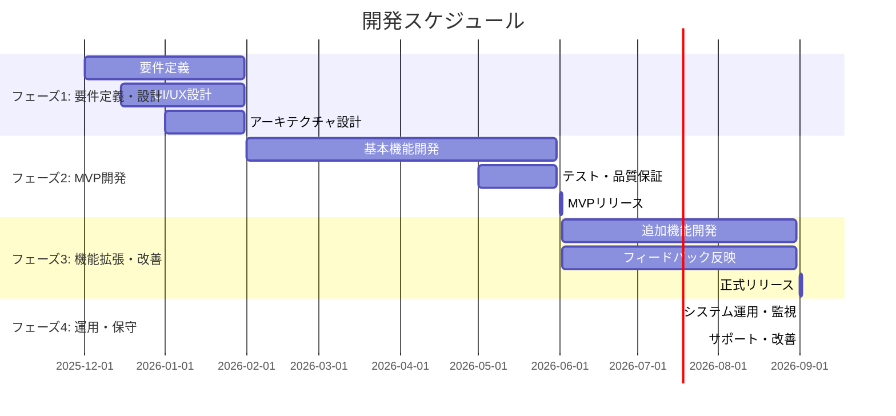

# 人事評価・研修統合プラットフォーム 開発計画書

## 1. はじめに

本ドキュメントは、「人事評価・研修統合プラットフォーム」の開発プロジェクトに関する計画を定めるものです。プロジェクトの目標、範囲、スケジュール、体制、成果物などを定義し、関係者間の共通認識を形成することを目的とします。

## 2. 開発の全体方針

本プロジェクトでは、アジャイル開発手法を採用します。変化するビジネス要求に柔軟に対応し、リスクを早期に発見・低減するため、開発プロセスを複数のフェーズに分割します。各フェーズの終わりには、動作するソフトウェアをリリースし、ステークホルダーからのフィードバックを得ながら開発を進めます。

## 3. 開発フェーズとスケジュール

開発は大きく分けて4つのフェーズで実施します。各フェーズの期間は目安であり、進捗やフィードバックに応じて調整します。

### フェーズ1: 要件定義・設計（約2ヶ月）

このフェーズでは、システムの全体像を具体化し、開発の土台を固めます。

| タスク | 内容 | 成果物 |
|---|---|---|
| **詳細要件定義** | 企画書を基に、各機能の詳細な仕様を定義します。ユーザーシナリオを作成し、画面遷移やデータフローを明確にします。 | 要件定義書、機能一覧、非機能要件定義書 |
| **UI/UX設計** | ワイヤーフレーム、プロトタイプを作成し、ユーザーにとって直感的で使いやすいインターフェースを設計します。 | ワイヤーフレーム、デザインカンプ、UIコンポーネント仕様書 |
| **アーキテクチャ設計** | 技術スタックを選定し、システムの全体構成、データベース設計、インフラ構成を詳細に設計します。 | システム構成図、ER図、インフラ構成図、API仕様書 |

### フェーズ2: MVP（Minimum Viable Product）開発（約4ヶ月）

このフェーズでは、中核となる最小限の機能セットを実装し、早期に市場投入することを目指します。

| タスク | 内容 | 成果物 |
|---|---|---|
| **環境構築** | 開発、ステージング、本番環境を構築します。CI/CDパイプラインを整備し、開発の自動化を図ります。 | 各種環境、CI/CDパイプライン |
| **コア機能開発** | 人事評価システムの基本機能（目標設定、評価実施）と、LMSの基本機能（コンテンツ配信、受講管理）を開発します。 | ソースコード、テストコード |
| **連携機能開発** | 評価結果と研修履歴の基本的なデータ連携機能を実装します。 | 連携モジュール |
| **テスト・品質保証** | 単体テスト、結合テスト、システムテストを実施し、品質を確保します。 | テスト仕様書、テスト報告書 |
| **MVPリリース** | 限定されたユーザー向けにMVPをリリースし、フィードバックを収集します。 | MVP版システム |

### フェーズ3: 機能拡張・改善（約3ヶ月）

MVPからのフィードバックを基に、機能の改善と追加開発を行います。

| タスク | 内容 | 成果物 |
|---|---|---|
| **フィードバック分析・反映** | MVPユーザーからのフィードバックを分析し、改善点の優先順位を決定して実装します。 | 改善タスクリスト |
| **追加機能開発** | 360度評価、詳細な分析・レポート機能、研修レコメンド機能などを開発します。 | ソースコード、テストコード |
| **パフォーマンステスト** | 負荷テストを実施し、システムのパフォーマンスとスケーラビリティを検証します。 | パフォーマンステスト報告書 |
| **正式リリース** | 全ての機能を実装し、品質を確保した上で、正式版として一般公開します。 | 正式版システム |

### フェーズ4: 運用・保守（継続）

システムの安定稼働を維持し、継続的な改善を行います。

| タスク | 内容 | 成果物 |
|---|---|---|
| **システム監視・運用** | サーバー、ネットワーク、アプリケーションの稼働状況を24時間365日監視し、障害発生時に迅速に対応します。 | 監視レポート、障害対応報告書 |
| **データバックアップ** | 定期的にデータをバックアップし、災害や障害からの復旧手順を確立します。 | バックアップデータ |
| **セキュリティ対策** | セキュリティパッチの適用、脆弱性情報の収集と対応を継続的に行います。 | セキュリティ監査報告書 |
| **ユーザーサポート** | ユーザーからの問い合わせに対応し、システムの利用を支援します。 | FAQ、マニュアル |
| **継続的改善** | ユーザーの利用状況や新たな要望を基に、機能改善や新機能の企画・開発を継続します。 | 改善計画書 |

## 4. 開発体制（案）

プロジェクトを円滑に推進するため、以下の役割でチームを構成することを提案します。

- **プロジェクトマネージャー**: プロジェクト全体の進捗管理、課題管理、関係者調整
- **UI/UXデザイナー**: ユーザー体験の設計、画面デザイン
- **フロントエンドエンジニア**: ユーザーインターフェースの実装
- **バックエンドエンジニア**: サーバーサイドのロジック、API、データベースの実装
- **インフラエンジニア**: サーバー、ネットワークの構築・運用
- **QAエンジニア**: テスト計画の策定、品質保証

## 5. 成果物一覧

- **ドキュメント**: 要件定義書、設計書（UI/UX、アーキテクチャ）、テスト仕様書、各種報告書
- **ソースコード**: アプリケーションの全ソースコード、テストコード
- **システム**: 動作可能なプラットフォーム（MVP版、正式版）
